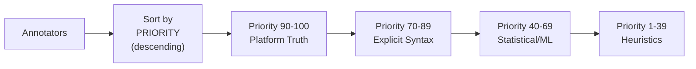

<!-- docs/annotators.md -->
# Annotation System

## Overview

The annotation system applies labels, tags, and metadata to entities using a typed table architecture. Multiple detection strategies can target the same semantic concept with priority-based resolution.

## Architecture

### Typed Annotation Tables

Each entity type has four annotation tables based on value type:

```
derived.{entity}_annotations_flag      # Boolean presence (key only)
derived.{entity}_annotations_string    # Text values
derived.{entity}_annotations_numeric   # Numeric values
derived.{entity}_annotations_json      # JSONB values
```

**Supported entity types:**
- `content_part` - Individual content segments
- `message` - Complete messages
- `prompt_response` - User-assistant pairs
- `dialogue` - Entire conversations

**Table schema example** (for `prompt_response_annotations_string`):

```sql
CREATE TABLE derived.prompt_response_annotations_string (
    id                  uuid PRIMARY KEY DEFAULT gen_random_uuid(),
    entity_id           uuid NOT NULL REFERENCES derived.prompt_responses(id),
    annotation_key      text NOT NULL,
    annotation_value    text NOT NULL,
    
    confidence          float,
    reason              text,
    source              text NOT NULL,
    source_version      text,
    created_at          timestamptz DEFAULT now(),
    
    UNIQUE (entity_id, annotation_key, annotation_value)
);
```

### Design Benefits

| Benefit | Description |
|---------|-------------|
| **Query Performance** | Direct filtering on typed columns |
| **Type Safety** | Database enforces value types |
| **Efficient Indexes** | Separate indexes per value type |
| **Null Handling** | Flags don't waste space on NULL values |
| **Schema Clarity** | Explicit value types in table names |

## Core Components

### AnnotationResult

Return value from annotator logic:

```python
from llm_archive.annotations.core import AnnotationResult, ValueType

# Flag annotation (presence = true)
AnnotationResult(
    key='has_code_blocks',
    value_type=ValueType.FLAG,
)

# String annotation
AnnotationResult(
    key='exchange_type',
    value='wiki_article',
    value_type=ValueType.STRING,
    confidence=0.9,
)

# Numeric annotation
AnnotationResult(
    key='response_quality_score',
    value=0.85,
    value_type=ValueType.NUMERIC,
    confidence=0.7,
)

# JSON annotation
AnnotationResult(
    key='code_blocks',
    value={'python': 3, 'javascript': 1},
    value_type=ValueType.JSON,
)
```

### AnnotationWriter

Inserts annotations into typed tables:

```python
from llm_archive.annotations.core import AnnotationWriter, EntityType

writer = AnnotationWriter(session)

# Write flag
writer.write_flag(
    entity_type=EntityType.PROMPT_RESPONSE,
    entity_id=pr_id,
    key='is_wiki_candidate',
    source='WikiCandidateAnnotator',
    source_version='1.0',
)

# Write string
writer.write_string(
    entity_type=EntityType.PROMPT_RESPONSE,
    entity_id=pr_id,
    key='proposed_title',
    value='Introduction to Machine Learning',
    confidence=0.8,
    source='NaiveTitleAnnotator',
)

# Write from AnnotationResult
result = AnnotationResult(key='tag', value='technical', value_type=ValueType.STRING)
writer.write_result(
    entity_type=EntityType.MESSAGE,
    entity_id=msg_id,
    result=result,
)
```

### AnnotationReader

Queries annotations from typed tables:

```python
from llm_archive.annotations.core import AnnotationReader, EntityType

reader = AnnotationReader(session)

# Check if flag exists
if reader.has_flag(EntityType.PROMPT_RESPONSE, pr_id, 'is_wiki_candidate'):
    print("This is a wiki candidate")

# Get string values
titles = reader.get_string(EntityType.PROMPT_RESPONSE, pr_id, 'proposed_title')
print(f"Proposed titles: {titles}")

# Get numeric value
score = reader.get_numeric(EntityType.MESSAGE, msg_id, 'sentiment_score')

# Get JSON value
metadata = reader.get_json(EntityType.DIALOGUE, dialogue_id, 'summary_stats')
```

## PromptResponseAnnotator Base Class

### Basic Structure

```python
from llm_archive.annotators.prompt_response import (
    PromptResponseAnnotator,
    PromptResponseData,
)
from llm_archive.annotations.core import AnnotationResult, ValueType

class MyAnnotator(PromptResponseAnnotator):
    # Metadata
    ANNOTATION_KEY = 'my_classification'
    VALUE_TYPE = ValueType.STRING
    PRIORITY = 50  # Higher runs first
    VERSION = '1.0'
    SOURCE = 'heuristic'
    
    # Optional: Filtering prerequisites
    REQUIRES_FLAGS = []  # Only process entities with these flags
    REQUIRES_STRINGS = []  # Only process entities with these (key, value) pairs
    SKIP_IF_FLAGS = []  # Skip entities with these flags
    SKIP_IF_STRINGS = []  # Skip entities with these key or (key, value) pairs
    
    def annotate(self, data: PromptResponseData) -> list[AnnotationResult]:
        """
        Annotate a single prompt-response pair.
        
        Args:
            data: PromptResponseData with all fields populated
        
        Returns:
            List of AnnotationResult objects (empty if no annotations)
        """
        if self._matches_criteria(data):
            return [AnnotationResult(
                key=self.ANNOTATION_KEY,
                value='my_value',
                confidence=0.9,
                reason='Matched pattern X',
            )]
        return []
```

### PromptResponseData

Data passed to annotation logic:

```python
@dataclass
class PromptResponseData:
    prompt_response_id: UUID
    dialogue_id: UUID
    prompt_message_id: UUID
    response_message_id: UUID
    prompt_text: str | None
    response_text: str | None
    prompt_word_count: int | None
    response_word_count: int | None
    prompt_role: str
    response_role: str
    created_at: datetime | None
```

### Annotation Filtering

Annotators can specify prerequisites and skip conditions:

```python
class WikiArticleAnnotator(PromptResponseAnnotator):
    ANNOTATION_KEY = 'is_wiki_article'
    VALUE_TYPE = ValueType.FLAG
    
    # Only process wiki candidates
    REQUIRES_STRINGS = [('exchange_type', 'wiki_article')]
    
    # Skip if already marked as low quality
    SKIP_IF_FLAGS = ['low_quality']
    
    def annotate(self, data: PromptResponseData) -> list[AnnotationResult]:
        # This only runs on wiki_article candidates without low_quality flag
        if self._is_complete_article(data.response_text):
            return [AnnotationResult(key=self.ANNOTATION_KEY)]
        return []
```

## Example Annotators

### WikiCandidateAnnotator

Identifies potential wiki articles:

```python
class WikiCandidateAnnotator(PromptResponseAnnotator):
    """Flag prompt-responses that look like wiki article requests/responses."""
    
    ANNOTATION_KEY = 'exchange_type'
    VALUE_TYPE = ValueType.STRING
    PRIORITY = 80
    VERSION = '1.0'
    
    WIKI_KEYWORDS = [
        'write an article', 'create an article', 'wiki article',
        'wikipedia style', 'encyclopedia entry', 'comprehensive guide',
    ]
    
    def annotate(self, data: PromptResponseData) -> list[AnnotationResult]:
        # Check prompt for wiki-like requests
        if not data.prompt_text:
            return []
        
        prompt_lower = data.prompt_text.lower()
        
        # Check for explicit wiki keywords
        for keyword in self.WIKI_KEYWORDS:
            if keyword in prompt_lower:
                return [AnnotationResult(
                    key=self.ANNOTATION_KEY,
                    value='wiki_article',
                    confidence=0.9,
                    reason=f'Matched keyword: {keyword}',
                )]
        
        # Check response length (wiki articles tend to be long)
        if data.response_word_count and data.response_word_count > 500:
            # Check for article structure (sections, etc.)
            if self._has_article_structure(data.response_text):
                return [AnnotationResult(
                    key=self.ANNOTATION_KEY,
                    value='wiki_article',
                    confidence=0.7,
                    reason='Long response with article structure',
                )]
        
        return []
    
    def _has_article_structure(self, text: str) -> bool:
        """Check if text has typical article structure."""
        if not text:
            return False
        
        # Look for multiple headings
        heading_patterns = ['\n## ', '\n### ', '\n#### ']
        heading_count = sum(text.count(pattern) for pattern in heading_patterns)
        
        return heading_count >= 3
```

### NaiveTitleAnnotator

Extracts potential titles from wiki articles:

```python
class NaiveTitleAnnotator(PromptResponseAnnotator):
    """
    Extract potential article title from response.
    
    Only runs on wiki_article candidates.
    """
    
    ANNOTATION_KEY = 'proposed_title'
    VALUE_TYPE = ValueType.STRING
    PRIORITY = 50
    VERSION = '1.0'
    
    # Only process wiki candidates
    REQUIRES_STRINGS = [('exchange_type', 'wiki_article')]
    
    def annotate(self, data: PromptResponseData) -> list[AnnotationResult]:
        if not data.response_text:
            return []
        
        # Strategy 1: Look for markdown H1
        lines = data.response_text.split('\n')
        for line in lines[:5]:  # Check first 5 lines
            if line.startswith('# '):
                title = line[2:].strip()
                if title:
                    return [AnnotationResult(
                        key=self.ANNOTATION_KEY,
                        value=title,
                        confidence=0.9,
                        reason='Found markdown H1',
                    )]
        
        # Strategy 2: Use first line if short enough
        first_line = lines[0].strip()
        if 5 <= len(first_line.split()) <= 10:
            return [AnnotationResult(
                key=self.ANNOTATION_KEY,
                value=first_line,
                confidence=0.6,
                reason='Used first line',
            )]
        
        return []
```

## Priority System

Annotators execute in priority order (highest first):



| Priority Range | Use Case | Example |
|----------------|----------|---------|
| 90-100 | Platform ground truth | ChatGPT code execution metadata |
| 70-89 | Explicit syntax detection | Code blocks, citations |
| 40-69 | Statistical/ML models | Semantic classification |
| 1-39 | Heuristics | Keyword matching |

## Incremental Processing

### Cursor-Based Execution

Annotators track processing state with cursors:

```sql
CREATE TABLE derived.annotator_cursors (
    id                      uuid PRIMARY KEY,
    annotator_name          text NOT NULL,
    annotator_version       text NOT NULL,
    entity_type             text NOT NULL,
    high_water_mark         timestamptz NOT NULL,
    entities_processed      int DEFAULT 0,
    annotations_created     int DEFAULT 0,
    updated_at              timestamptz DEFAULT now(),
    
    UNIQUE (annotator_name, annotator_version, entity_type)
);
```

### Execution Flow

```python
def compute(self) -> int:
    """Run annotation with cursor tracking."""
    # Get or create cursor
    cursor = self._get_cursor()
    
    # Query entities created after cursor
    entities = self._iter_prompt_responses_after(cursor.high_water_mark)
    
    count = 0
    latest_created_at = cursor.high_water_mark
    
    for data in entities:
        results = self.annotate(data)
        for result in results:
            if self._write_result(data.prompt_response_id, result):
                count += 1
        
        # Track latest timestamp
        if data.created_at and data.created_at > latest_created_at:
            latest_created_at = data.created_at
    
    # Update cursor
    self._update_cursor(cursor, count, latest_created_at)
    
    return count
```

## Running Annotators

### Via CLI

```bash
# Run all registered annotators
llm-archive annotate

# Run specific annotator
llm-archive annotate WikiCandidateAnnotator

# Clear and re-run (ignores cursors)
llm-archive annotate --clear
```

### Via Python

```python
from llm_archive.cli import AnnotationManager
from sqlalchemy.orm import Session

# Create manager
manager = AnnotationManager(session)

# Register annotators
manager.register(WikiCandidateAnnotator)
manager.register(NaiveTitleAnnotator)

# Run all (respects priorities and cursors)
results = manager.run_all()
print(f"Created {results['total_annotations']} annotations")

# Run specific annotator
results = manager.run_one('WikiCandidateAnnotator')
```

## Querying Annotations

### Via Views

Use convenience views for common queries:

```sql
-- Get all wiki article candidates with proposed titles
SELECT 
    pr.id,
    pr.dialogue_id,
    prc.prompt_text,
    prc.response_text,
    (SELECT annotation_value 
     FROM derived.prompt_response_annotations_string 
     WHERE entity_id = pr.id AND annotation_key = 'proposed_title') as title
FROM derived.prompt_responses pr
JOIN derived.prompt_response_content prc ON prc.prompt_response_id = pr.id
JOIN derived.prompt_response_annotations_string ans ON ans.entity_id = pr.id
WHERE ans.annotation_key = 'exchange_type' AND ans.annotation_value = 'wiki_article';
```

### Via Python

```python
# Get all wiki candidates
wiki_candidates = (
    session.query(PromptResponse)
    .join(
        prompt_response_annotations_string,
        PromptResponse.id == prompt_response_annotations_string.c.entity_id
    )
    .filter(
        prompt_response_annotations_string.c.annotation_key == 'exchange_type',
        prompt_response_annotations_string.c.annotation_value == 'wiki_article',
    )
    .all()
)
```

## Best Practices

### 1. Choose Appropriate Priority

```python
# Platform truth = 90-100
class ChatGPTCodeExecutionAnnotator(PromptResponseAnnotator):
    PRIORITY = 100

# Explicit syntax = 70-89
class CodeBlockDetector(PromptResponseAnnotator):
    PRIORITY = 80

# Heuristics = 1-39
class KeywordMatcher(PromptResponseAnnotator):
    PRIORITY = 30
```

### 2. Return Appropriate Confidence

```python
# Ground truth
AnnotationResult(value='has_code_execution', confidence=1.0)

# Strong signal
AnnotationResult(value='has_code_blocks', confidence=1.0)

# Moderate signal
AnnotationResult(value='technical_content', confidence=0.7)

# Weak signal
AnnotationResult(value='possibly_tutorial', confidence=0.5)
```

### 3. Use Filtering Effectively

```python
# Only process specific types
REQUIRES_STRINGS = [('exchange_type', 'wiki_article')]

# Avoid reprocessing
SKIP_IF_FLAGS = ['already_processed']

# Avoid conflicts
SKIP_IF_STRINGS = [('proposed_title',)]  # Skip if any title exists
```

### 4. Version Appropriately

```python
class MyAnnotator(PromptResponseAnnotator):
    VERSION = '1.0'  # Initial
    # VERSION = '1.1'  # Bug fix
    # VERSION = '2.0'  # Major logic change
```

Changing VERSION creates a new cursor, allowing re-annotation without clearing.

## Testing

### Unit Tests

Test annotation logic without database:

```python
def test_wiki_candidate_detection():
    """Test wiki candidate detection logic."""
    annotator = WikiCandidateAnnotator(mock_session)
    
    data = PromptResponseData(
        prompt_response_id=uuid4(),
        dialogue_id=uuid4(),
        prompt_message_id=uuid4(),
        response_message_id=uuid4(),
        prompt_text="Write a wiki article about Python",
        response_text="# Python\n\nPython is...",
        prompt_word_count=6,
        response_word_count=500,
        prompt_role='user',
        response_role='assistant',
        created_at=datetime.now(),
    )
    
    results = annotator.annotate(data)
    assert len(results) == 1
    assert results[0].value == 'wiki_article'
```

### Integration Tests

Test full annotation cycle:

```python
def test_annotation_creates_records(session, sample_prompt_response):
    """Test annotation creates database records."""
    annotator = WikiCandidateAnnotator(session)
    count = annotator.compute()
    
    assert count > 0
    
    # Verify record exists
    reader = AnnotationReader(session)
    assert reader.has_string(
        EntityType.PROMPT_RESPONSE,
        sample_prompt_response.id,
        'exchange_type',
        'wiki_article',
    )
```

## Related Documentation

- [Architecture Overview](architecture.md)
- [Schema Design](schema.md) - Annotation table schema
- [Models](models.md) - Annotation models
- [CLI Reference](cli.md) - Running annotators via CLI
- [Builders](builders.md) - Creating entities to annotate
