# docs/annotators.md
# Annotation System

## Overview

The annotation system provides a flexible framework for adding labels, tags, and metadata to entities (messages, exchanges, dialogues). It supports:

- **Multiple entity types**: Messages, exchanges, dialogues
- **Annotation types**: Tags, features, metadata, titles, summaries
- **Strategy pattern**: Multiple annotators can target the same semantic concept
- **Incremental processing**: Cursor-based to avoid reprocessing
- **Provenance tracking**: Source, version, confidence for all annotations

## Architecture

```mermaid
flowchart TB
    subgraph Entities["Entity Types"]
        Messages["Messages"]
        Exchanges["Exchanges"]
        Dialogues["Dialogues"]
    end
    
    subgraph Manager["AnnotationManager"]
        Register["register()"]
        RunAll["run_all()"]
        HasKey["has_annotation_key()"]
        GetStrat["get_strategy_info()"]
    end
    
    subgraph Annotators["Annotator Classes"]
        direction TB
        
        subgraph MsgAnnotators["Message Annotators"]
            Code1["CodeBlockAnnotator<br/>priority=90"]
            Code2["ScriptHeaderAnnotator<br/>priority=85"]
            Code3["CodeStructureAnnotator<br/>priority=70"]
            Wiki["WikiLinkAnnotator"]
            Latex["LatexAnnotator"]
        end
        
        subgraph ExchAnnotators["Exchange Annotators"]
            Type["ExchangeTypeAnnotator"]
            Evidence["CodeEvidenceAnnotator"]
            Title["TitleExtractionAnnotator"]
        end
        
        subgraph DlgAnnotators["Dialogue Annotators"]
            Length["DialogueLengthAnnotator"]
            Stats["PromptStatsAnnotator"]
            Pattern["InteractionPatternAnnotator"]
        end
        
        subgraph PlatAnnotators["Platform Annotators"]
            Search["ChatGPTWebSearchAnnotator<br/>priority=100"]
            CodeExec["ChatGPTCodeExecutionAnnotator<br/>priority=100"]
            Gizmo["ChatGPTGizmoAnnotator"]
        end
    end
    
    subgraph Storage["Storage"]
        Annotations["derived.annotations"]
        Cursors["derived.annotator_cursors"]
    end
    
    Messages --> MsgAnnotators
    Exchanges --> ExchAnnotators
    Dialogues --> DlgAnnotators
    Exchanges --> PlatAnnotators
    
    MsgAnnotators --> Annotations
    ExchAnnotators --> Annotations
    DlgAnnotators --> Annotations
    PlatAnnotators --> Annotations
    
    Manager --> Annotators
    Annotators --> Cursors
```



## Core Concepts

### Annotation Keys vs Annotators (Strategy Pattern)

An **annotation key** identifies *what* we're trying to detect (e.g., "code", "latex", "web_search"). Multiple **annotators** can target the same key using different **strategies**, ordered by **priority**.


**Priority Guidelines:**

| Priority | Use Case | Examples |
|----------|----------|----------|
| 100 | Platform ground truth | Code execution records, web search results |
| 90 | Explicit syntax | Markdown code blocks (```) |
| 85 | Strong indicators | Shebangs, #include |
| 70 | Structural patterns | Function definitions with full syntax |
| 50 | Keyword detection | `def`, `function`, `import` keywords |
| 30 | Heuristics | Keyword density analysis |

### Incremental Processing

Each annotator tracks a **cursor** (high water mark) to avoid reprocessing:


**Version Bumping**: Change `VERSION` in annotator class to force reprocessing all entities.

---

## Base Classes

### Annotator (Abstract Base)

```python
class Annotator(ABC):
    """Base class for all annotators."""
    
    # Required class attributes
    ANNOTATION_TYPE: str = None  # 'tag', 'feature', 'metadata', 'title'
    ENTITY_TYPE: str = None      # 'message', 'exchange', 'dialogue'
    SOURCE: str = 'heuristic'    # 'manual', 'heuristic', 'model'
    VERSION: str = '1.0'         # Bump to reprocess all entities
    
    # Strategy system (optional)
    ANNOTATION_KEY: str | None = None  # What we're detecting
    PRIORITY: int = 50                  # Higher runs first (0-100)
    
    def __init__(self, session: Session):
        self.session = session
    
    @abstractmethod
    def compute(self) -> int:
        """Run annotation logic, return count of annotations created."""
        pass
```

### AnnotationResult

```python
@dataclass
class AnnotationResult:
    """Result from annotator to be stored."""
    value: str                          # The annotation value
    key: str | None = None              # Optional sub-key
    confidence: float | None = None     # 0.0-1.0
    data: dict | None = None            # Additional structured data
```

### MessageTextAnnotator

For annotating messages based on text content:

```python
class MessageTextAnnotator(Annotator):
    """Base for message text analysis."""
    
    ENTITY_TYPE = 'message'
    ROLE_FILTER: str | None = None  # 'user', 'assistant', or None for all
    
    def compute(self) -> int:
        """Iterate messages, call annotate() on each."""
        count = 0
        for data in self._iter_messages():
            self.track_entity(data.created_at)
            results = self.annotate(data)
            for result in results:
                if self.add_result(data.message_id, result):
                    count += 1
        self.finalize_cursor()
        return count
    
    @abstractmethod
    def annotate(self, data: MessageTextData) -> list[AnnotationResult]:
        """Analyze message text, return annotations."""
        pass


@dataclass
class MessageTextData:
    """Data passed to message annotators."""
    message_id: UUID
    text: str
    created_at: datetime | None
    role: str
```

### ExchangeAnnotator

For annotating exchanges based on aggregated content:

```python
class ExchangeAnnotator(Annotator):
    """Base for exchange content analysis."""
    
    ENTITY_TYPE = 'exchange'
    
    @abstractmethod
    def annotate(self, data: ExchangeData) -> list[AnnotationResult]:
        pass


@dataclass
class ExchangeData:
    """Data passed to exchange annotators."""
    exchange_id: UUID
    user_text: str | None
    assistant_text: str | None
    user_word_count: int | None
    assistant_word_count: int | None
    created_at: datetime | None
```

### ExchangePlatformAnnotator

For annotating exchanges by querying platform feature tables:

```python
class ExchangePlatformAnnotator(Annotator):
    """Base for platform feature queries."""
    
    ENTITY_TYPE = 'exchange'
    
    @abstractmethod
    def annotate(self, data: ExchangePlatformData) -> list[AnnotationResult]:
        pass


@dataclass
class ExchangePlatformData:
    """Data passed to platform annotators."""
    exchange_id: UUID
    dialogue_id: UUID
    message_ids: list[UUID]          # All messages in exchange
    user_message_ids: list[UUID]     # User messages only
    assistant_message_ids: list[UUID] # Assistant messages only
    created_at: datetime | None
```

### DialogueAnnotator

For annotating dialogues with aggregate statistics:

```python
class DialogueAnnotator(Annotator):
    """Base for dialogue-level analysis."""
    
    ENTITY_TYPE = 'dialogue'
    
    @abstractmethod
    def annotate(self, data: DialogueData) -> list[AnnotationResult]:
        pass


@dataclass
class DialogueData:
    """Data passed to dialogue annotators."""
    dialogue_id: UUID
    source: str
    title: str | None
    exchange_count: int
    message_count: int
    user_message_count: int
    assistant_message_count: int
    user_texts: list[str]
    assistant_texts: list[str]
    user_word_counts: list[int]
    assistant_word_counts: list[int]
    created_at: datetime | None
    first_user_text: str | None
    first_assistant_text: str | None
```

---

## AnnotationManager

The manager coordinates annotator registration and execution:

```python
class AnnotationManager:
    """Manages annotator registration and execution."""
    
    def __init__(self, session: Session):
        self.session = session
        self.annotators: list[Annotator] = []
    
    def register(self, annotator_class: type[Annotator]):
        """Register an annotator class."""
        annotator = annotator_class(self.session)
        self.annotators.append(annotator)
    
    def run_all(self) -> dict[str, int]:
        """Run all registered annotators in priority order."""
        results = {}
        for annotator in self._sorted_annotators():
            name = annotator.__class__.__name__
            try:
                count = annotator.compute()
                results[name] = count
            except Exception as e:
                logger.error(f"{name} failed: {e}")
                results[name] = -1
                self.session.rollback()
        self.session.commit()
        return results
    
    def has_annotation_key(
        self,
        entity_type: str,
        entity_id: UUID,
        annotation_key: str,
    ) -> bool:
        """Check if annotation key exists for entity."""
        # Useful for lower-priority annotators to skip work
```

### Strategy Resolution

```python
def get_strategy_info(self) -> dict[str, list[tuple[str, int]]]:
    """Get registered strategies grouped by annotation key."""
    strategies = {}
    for annotator in self.annotators:
        key = annotator.ANNOTATION_KEY or '<none>'
        if key not in strategies:
            strategies[key] = []
        strategies[key].append((annotator.name, annotator.PRIORITY))
    
    # Sort each by priority descending
    for key in strategies:
        strategies[key].sort(key=lambda x: x[1], reverse=True)
    
    return strategies

# Example output:
# {
#     'code': [
#         ('ChatGPTCodeExecutionAnnotator', 100),
#         ('CodeBlockAnnotator', 90),
#         ('ScriptHeaderAnnotator', 85),
#         ('CodeStructureAnnotator', 70),
#         ('FunctionDefinitionAnnotator', 50),
#         ('CodeKeywordDensityAnnotator', 30),
#     ],
#     'latex': [('LatexAnnotator', 50)],
#     'wiki_links': [('WikiLinkAnnotator', 50)],
# }
```

---

## Built-in Annotators

### Message Annotators

#### Code Detection Hierarchy

| Annotator | Priority | Detection Method | Confidence |
|-----------|----------|------------------|------------|
| `CodeBlockAnnotator` | 90 | Explicit ``` syntax | 1.0 |
| `ScriptHeaderAnnotator` | 85 | `#!/bin/`, `#include` | 1.0 |
| `CodeStructureAnnotator` | 70 | Function/class patterns | 0.95 |
| `FunctionDefinitionAnnotator` | 50 | `def`, `function` keywords | 0.8 |
| `ImportStatementAnnotator` | 50 | `import`, `require()` | 0.9 |
| `CodeKeywordDensityAnnotator` | 30 | High keyword density | 0.5-0.9 |

**Example: CodeBlockAnnotator**

```python
class CodeBlockAnnotator(MessageTextAnnotator):
    """Detect explicit code blocks (```)."""
    
    ANNOTATION_TYPE = 'feature'
    ANNOTATION_KEY = 'code'
    PRIORITY = 90
    VERSION = '1.1'
    ROLE_FILTER = None
    
    LANGUAGE_PATTERN = re.compile(r'```(\w*)\n')
    
    def annotate(self, data: MessageTextData) -> list[AnnotationResult]:
        if '```' not in data.text:
            return []
        
        languages = self.LANGUAGE_PATTERN.findall(data.text)
        languages = [lang for lang in languages if lang]
        
        results = [AnnotationResult(
            value='has_code_blocks',
            confidence=1.0,
            data={
                'count': data.text.count('```') // 2,
                'languages': list(set(languages)),
            },
        )]
        
        # Add language-specific annotations
        for lang in set(languages):
            results.append(AnnotationResult(
                value=lang,
                key='code_language',
                confidence=1.0,
            ))
        
        return results
```

#### Other Message Annotators

| Annotator | Key | Detects |
|-----------|-----|---------|
| `WikiLinkAnnotator` | wiki_links | `[[wiki links]]` |
| `LatexAnnotator` | latex | `$$`, `\frac`, `\int` |
| `ContinuationAnnotator` | continuation | "continue", "elaborate" |
| `QuoteElaborateAnnotator` | continuation | `> quote\nelaborate` |

### Exchange Annotators

| Annotator | Key | Purpose |
|-----------|-----|---------|
| `ExchangeTypeAnnotator` | exchange_type | Classify: coding, qa, article |
| `CodeEvidenceAnnotator` | code_evidence | Tier: strong/moderate/weak |
| `TitleExtractionAnnotator` | proposed_title | Extract `# Title` from response |

### Dialogue Annotators

| Annotator | Key | Computes |
|-----------|-----|----------|
| `DialogueLengthAnnotator` | dialogue_length | single/short/medium/long/very_long |
| `PromptStatsAnnotator` | prompt_stats | mean/median/variance, consistency |
| `FirstExchangeAnnotator` | first_exchange | context_dump, starts_with_code |
| `InteractionPatternAnnotator` | interaction_pattern | brief/extended/interactive |
| `CodingAssistanceAnnotator` | coding_assistance | Dialogue-level code detection |

### ChatGPT Platform Annotators

All priority=100 (ground truth):

| Annotator | Key | Data Source |
|-----------|-----|-------------|
| `ChatGPTCodeExecutionAnnotator` | code | `chatgpt_code_executions` |
| `ChatGPTWebSearchAnnotator` | web_search | `chatgpt_search_groups` |
| `ChatGPTCanvasAnnotator` | canvas | `chatgpt_canvas_docs` |
| `ChatGPTGizmoAnnotator` | gizmo | `chatgpt_message_meta` |
| `ChatGPTAttachmentAnnotator` | attachment | `attachments` |
| `ChatGPTDalleAnnotator` | image_generation | `chatgpt_dalle_generations` |

---

## Creating Custom Annotators

### Step 1: Choose Base Class

```python
# For text content analysis
class MyMessageAnnotator(MessageTextAnnotator):
    pass

# For exchange-level analysis
class MyExchangeAnnotator(ExchangeAnnotator):
    pass

# For platform feature queries
class MyChatGPTAnnotator(ExchangePlatformAnnotator):
    pass

# For dialogue aggregates
class MyDialogueAnnotator(DialogueAnnotator):
    pass
```

### Step 2: Define Class Attributes

```python
class SentimentAnnotator(MessageTextAnnotator):
    """Detect message sentiment."""
    
    ANNOTATION_TYPE = 'tag'           # 'tag', 'feature', 'metadata'
    ANNOTATION_KEY = 'sentiment'      # What we're detecting
    PRIORITY = 50                     # Execution order
    VERSION = '1.0'                   # Bump to reprocess
    ROLE_FILTER = 'user'              # Only user messages
```

### Step 3: Implement annotate()

```python
def annotate(self, data: MessageTextData) -> list[AnnotationResult]:
    """Analyze message and return annotations."""
    
    # Your detection logic
    sentiment = self._analyze_sentiment(data.text)
    
    if sentiment:
        return [AnnotationResult(
            value=sentiment,           # e.g., 'positive', 'negative'
            key='sentiment',           # Optional sub-key
            confidence=0.85,           # How confident
            data={'score': 0.73},      # Additional data
        )]
    
    return []  # No annotation if not detected
```

### Step 4: Register and Run

```python
from llm_archive.annotators import AnnotationManager

manager = AnnotationManager(session)
manager.register(SentimentAnnotator)
manager.register(CodeBlockAnnotator)
# ... register more

results = manager.run_all()
# {'SentimentAnnotator': 150, 'CodeBlockAnnotator': 89, ...}
```

---

## Annotation Schema

### Storage Model

```python
class Annotation(Base):
    """Stored annotation."""
    
    # Target
    entity_type = Column(String)       # 'message', 'exchange', 'dialogue'
    entity_id = Column(UUID)
    
    # Content
    annotation_type = Column(String)   # 'tag', 'feature', 'metadata'
    annotation_key = Column(String)    # Optional sub-key
    annotation_value = Column(String)  # The value
    annotation_data = Column(JSONB)    # Additional structured data
    
    # Provenance
    confidence = Column(Float)         # 0.0-1.0
    source = Column(String)            # 'heuristic', 'model', 'manual'
    source_version = Column(String)    # Annotator version
    
    # Lifecycle
    created_at = Column(DateTime)
    superseded_at = Column(DateTime)   # For versioning
    superseded_by = Column(UUID)
```

### Querying Annotations

```python
# Get all tags for an exchange
tags = manager.get_tags('exchange', exchange_id)
# ['coding', 'long_response', ...]

# Get title for dialogue
title = manager.get_title('dialogue', dialogue_id)
# 'Python Tutorial Discussion'

# Get all annotations with filters
annotations = manager.get_annotations(
    entity_type='exchange',
    entity_id=exchange_id,
    annotation_type='feature',
    annotation_key='code',  # Filter by key
    active_only=True,       # Exclude superseded
)

# Get full annotation dict
all_annotations = manager.get_entity_annotations('exchange', exchange_id)
# {
#     'feature:code:has_code_blocks': {'confidence': 1.0, 'data': {...}},
#     'tag:exchange_type:coding': {'confidence': 0.8},
#     ...
# }
```

---

## Module Structure

```
annotators/
├── __init__.py          # Exports and documentation
├── base.py              # Base classes, manager, cursors
├── message.py           # Message text annotators
├── exchange.py          # Exchange content annotators
├── dialogue.py          # Dialogue aggregate annotators
└── chatgpt.py           # ChatGPT platform annotators
```

### Module Exports

```python
from llm_archive.annotators import (
    # Base classes
    Annotator,
    AnnotationManager,
    AnnotationResult,
    MessageTextAnnotator,
    MessageTextData,
    ExchangeAnnotator,
    ExchangeData,
    ExchangePlatformAnnotator,
    ExchangePlatformData,
    DialogueAnnotator,
    DialogueData,
    
    # Built-in annotators
    CodeBlockAnnotator,
    WikiLinkAnnotator,
    LatexAnnotator,
    ExchangeTypeAnnotator,
    DialogueLengthAnnotator,
    ChatGPTCodeExecutionAnnotator,
    # ... and more
)
```

---

## Best Practices

### 1. Choose Appropriate Priority

```python
# Platform truth = 100
class MyPlatformAnnotator(ExchangePlatformAnnotator):
    PRIORITY = 100

# Explicit syntax = 90
class MyExplicitSyntaxAnnotator(MessageTextAnnotator):
    PRIORITY = 90

# Heuristics = 30
class MyHeuristicAnnotator(MessageTextAnnotator):
    PRIORITY = 30
```

### 2. Return Appropriate Confidence

```python
# Ground truth
AnnotationResult(value='has_code_execution', confidence=1.0)

# Strong signal
AnnotationResult(value='has_code_blocks', confidence=1.0)

# Moderate signal
AnnotationResult(value='has_function_definitions', confidence=0.8)

# Weak signal
AnnotationResult(value='has_high_keyword_density', confidence=0.5)
```

### 3. Include Useful Data

```python
AnnotationResult(
    value='has_code_blocks',
    confidence=1.0,
    data={
        'count': 3,
        'languages': ['python', 'javascript'],
        'total_lines': 45,
    },
)
```

### 4. Version Appropriately

```python
# Bump version when logic changes
class MyAnnotator(MessageTextAnnotator):
    VERSION = '1.0'  # Initial
    VERSION = '1.1'  # Bug fix
    VERSION = '2.0'  # Major logic change
```

---

## Related Documentation

- [Architecture Overview](architecture.md)
- [Schema Design](schema.md) - Annotation table schema
- [Models](models.md) - Annotation SQLAlchemy model
- [CLI Reference](cli.md) - Running annotators via CLI