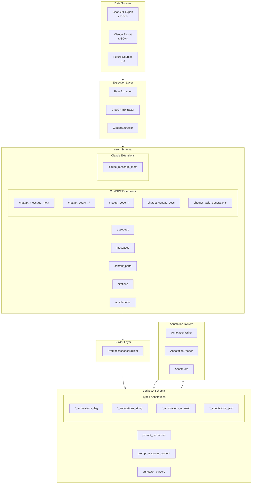
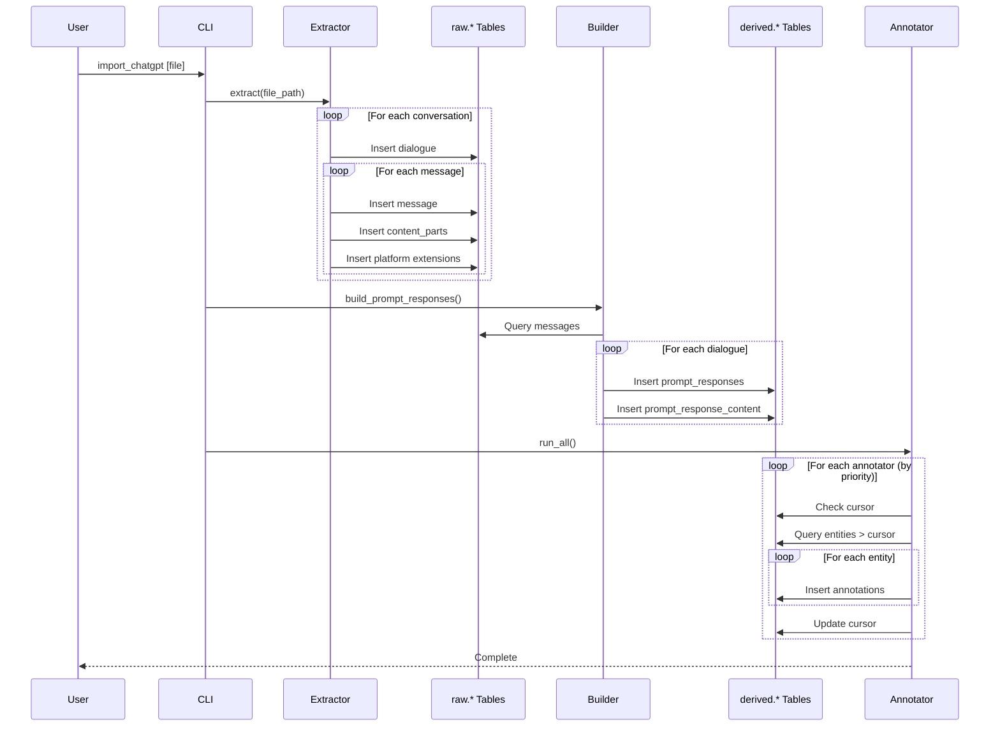
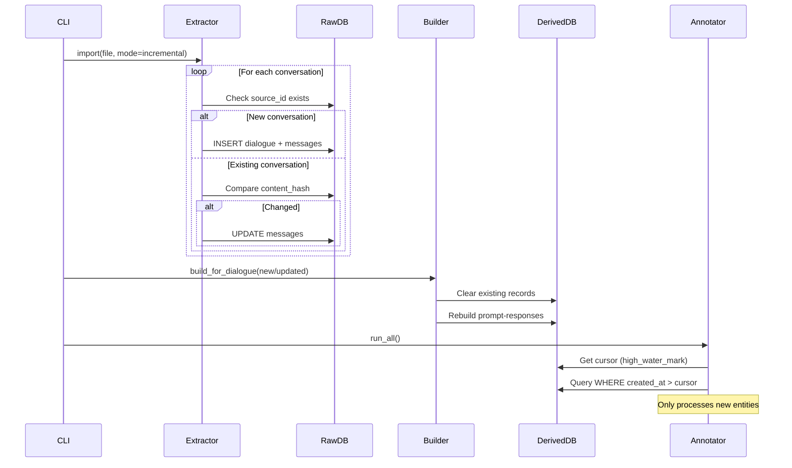
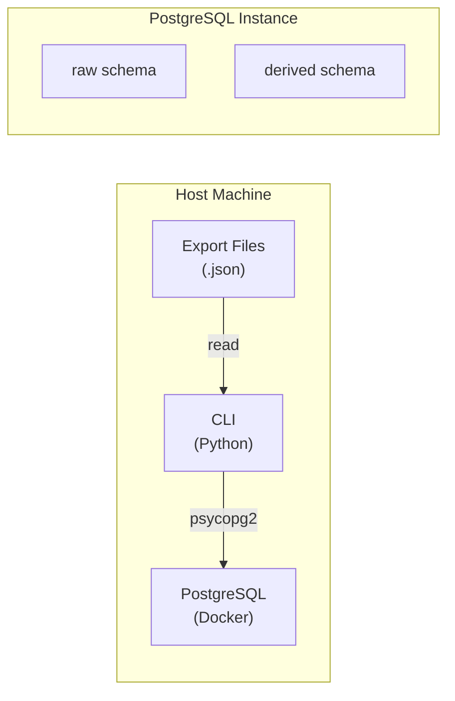

<!-- docs/architecture.md -->
# LLM Archive: System Architecture

## Overview

LLM Archive is a system for importing, normalizing, analyzing, and annotating conversation data from multiple LLM platforms (ChatGPT, Claude, and future sources). It transforms heterogeneous export formats into a unified data model optimized for annotation and downstream processing.

## Design Philosophy

### Core Principles

1. **Source Fidelity**: Raw data is preserved exactly as received; normalization happens in derived layers
2. **Schema Separation**: Clear distinction between raw (immutable imports) and derived (computed analysis)
3. **Incremental Processing**: All analysis is cursor-based to support efficient updates
4. **Platform Abstraction**: Common abstractions with platform-specific extensions
5. **Typed Annotations**: Separate tables per annotation type for query performance

### Key Architectural Decisions

| Decision | Rationale |
|----------|-----------|
| Two-schema design (raw/derived) | Preserves original data while enabling computed views |
| Tree-native message structure | ChatGPT exports are trees; maintain in raw layer |
| Prompt-response as fundamental unit | Simpler than exchange model, no tree dependency |
| Typed annotation tables | Better query performance than polymorphic table |
| Cursor-based incremental processing | Efficient re-annotation without full reprocessing |

## System Architecture



## Data Flow

### Import Flow



### Incremental Update Flow



## Component Responsibilities

### Extractors

Transform platform-specific export formats into the universal raw schema:

| Component | Responsibility |
|-----------|---------------|
| `BaseExtractor` | Common interface, deduplication, transaction management |
| `ChatGPTExtractor` | Parse conversations.json, handle tree structure, extract platform features |
| `ClaudeExtractor` | Parse Claude exports, synthesize linear parent-child relationships |

### Builders

Compute derived structures from raw data:

| Component | Responsibility |
|-----------|---------------|
| `PromptResponseBuilder` | Create user→assistant pairs using parent_id with sequential fallback |

### Annotations

Apply labels, tags, and metadata to entities:

| Component | Responsibility |
|-----------|---------------|
| `AnnotationWriter` | Insert annotations into typed tables |
| `AnnotationReader` | Query annotations from typed tables |
| `PromptResponseAnnotator` | Base class for annotating prompt-response pairs |
| Example annotators | `WikiCandidateAnnotator`, `NaiveTitleAnnotator` |

## Deployment Architecture



### Container Setup

```yaml
# docker-compose.yml
services:
  postgres:
    image: pgvector/pgvector:pg16
    ports:
      - "5432:5432"
    environment:
      POSTGRES_DB: llm_archive
      POSTGRES_USER: postgres
      POSTGRES_PASSWORD: postgres
    volumes:
      - pgdata:/var/lib/postgresql/data
```

## Extension Points

### Adding a New Source

1. Create extractor class extending `BaseExtractor`
2. Add source entry to `raw.sources` table
3. Create platform extension tables if needed
4. Implement message parent-child linking logic

### Adding a New Annotator

1. Extend `PromptResponseAnnotator` base class
2. Define `ANNOTATION_KEY` for grouping
3. Set `PRIORITY` relative to existing annotators
4. Choose `VALUE_TYPE` (flag, string, numeric, json)
5. Implement `annotate()` method returning `AnnotationResult` list
6. Register with CLI

### Adding a New Derived Structure

1. Design schema in new SQL file (e.g., `schema/009_*.sql`)
2. Create SQLAlchemy model in `models/derived.py`
3. Create builder class in `builders/`
4. Integrate with CLI pipeline

### Adding a New Entity Type for Annotations

1. Add entity type to `EntityType` enum in `annotations/core.py`
2. Create annotation tables in schema (4 tables per entity type)
3. Update `AnnotationWriter`/`AnnotationReader` table templates
4. Create base annotator class for the entity type

## Performance Considerations

### Indexing Strategy

- Raw tables: Indexed on `dialogue_id`, `parent_id`, `created_at`
- Derived tables: Indexed on foreign keys and filtered columns
- Annotation tables: Indexed on `entity_id`, `annotation_key`, and `annotation_value`

### Batch Processing

- Extractors use batch inserts (1000 messages/batch)
- Builders process dialogues individually with periodic commits
- Annotators use cursor-based incremental processing

### Memory Management

- Builders iterate dialogues without loading all into memory
- Content aggregation uses database-side text concatenation
- Large dialogues processed incrementally

## Security Considerations

- All data stored locally (no cloud dependencies)
- Database credentials via environment variables
- Source JSON preserved for audit trail
- No PII-specific handling (user responsibility)

## Annotation System Architecture

### Typed Annotation Tables

Each entity type has 4 annotation tables:

```
derived.{entity}_annotations_flag      # Boolean presence
derived.{entity}_annotations_string    # Text values
derived.{entity}_annotations_numeric   # Numeric values
derived.{entity}_annotations_json      # JSONB values
```

### Annotation Workflow

1. **Annotator Registration**: Annotators are ordered by priority
2. **Cursor Check**: Each annotator checks its high-water mark
3. **Entity Query**: Query entities created after cursor
4. **Annotation Logic**: Run detection/classification logic
5. **Result Writing**: Write results to appropriate typed table
6. **Cursor Update**: Update high-water mark for next run

### Priority System

| Priority Range | Use Case | Example |
|----------------|----------|---------|
| 90-100 | Platform ground truth | ChatGPT metadata flags |
| 70-89 | Explicit syntax detection | Code block detection |
| 40-69 | Statistical/ML models | Semantic classification |
| 1-39 | Heuristics | Keyword matching |

## Related Documentation

- [Schema Design](schema.md) - Database schema details
- [Models](models.md) - SQLAlchemy ORM models  
- [Extractors](extractors.md) - Data extraction system
- [Builders](builders.md) - Derived data construction
- [Annotators](annotators.md) - Annotation system
- [CLI Reference](cli.md) - Command-line interface
- [Testing](testing.md) - Testing strategy
