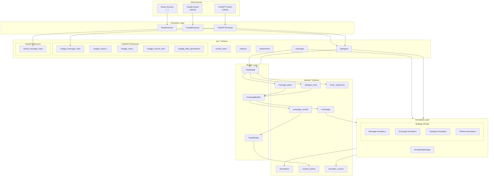
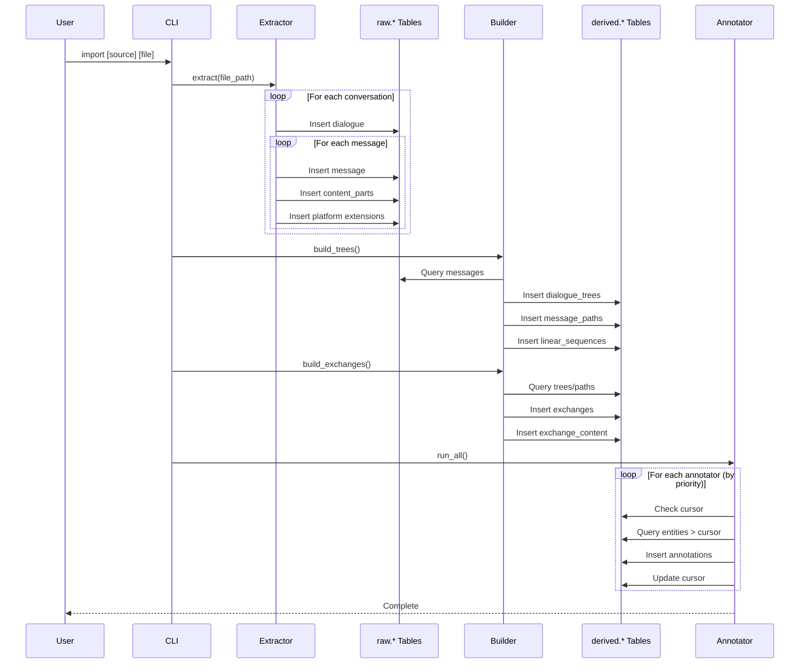
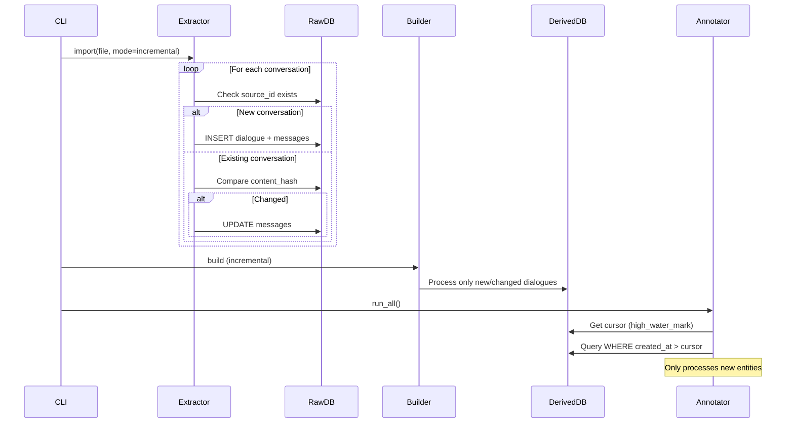
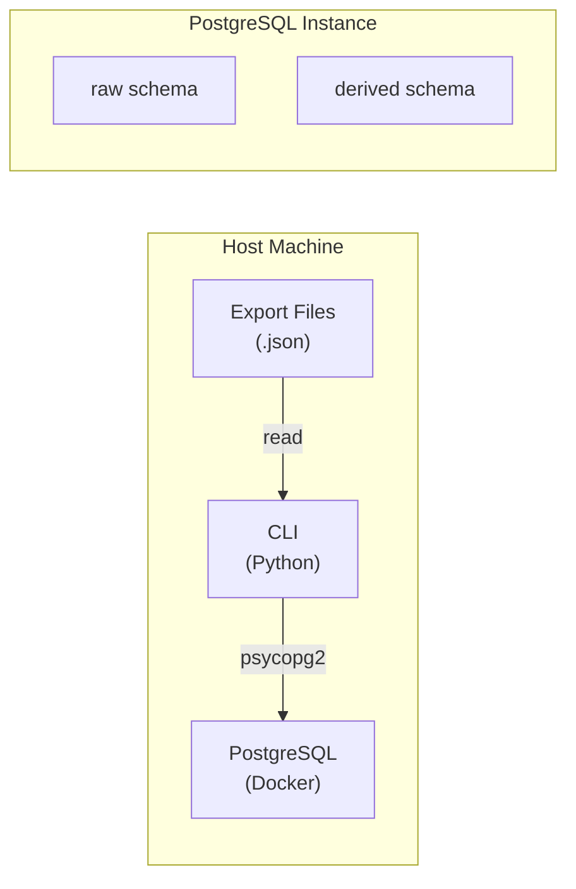

# docs/architecture.md
# LLM Archive: System Architecture

## Overview

LLM Archive is a system for importing, normalizing, analyzing, and annotating conversation data from multiple LLM platforms (ChatGPT, Claude, and future sources). It transforms heterogeneous export formats into a unified data model that supports both tree-structured and linear conversation representations.

## Design Philosophy

### Core Principles

1. **Source Fidelity**: Raw data is preserved exactly as received; normalization happens in derived layers
2. **Schema Separation**: Clear distinction between raw (immutable imports) and derived (computed analysis)
3. **Incremental Processing**: All analysis is cursor-based to support efficient updates
4. **Platform Abstraction**: Common abstractions with platform-specific extensions
5. **Annotation Strategy Pattern**: Multiple detection strategies can target the same semantic concept

### Key Architectural Decisions

| Decision | Rationale |
|----------|-----------|
| Two-schema design (raw/derived) | Preserves original data while enabling computed views |
| Tree-native message structure | ChatGPT exports are trees; linearization is derived |
| Exchange as fundamental unit | User-assistant pairs are the atomic interaction unit |
| Polymorphic annotations | Single table serves all entity types with provenance |
| Cursor-based incremental processing | Efficient re-annotation without full reprocessing |

## System Architecture



## Data Flow

### Import Pipeline



### Incremental Update Flow



## Component Responsibilities

### Extractors

Transform platform-specific export formats into the universal raw schema:

| Component | Responsibility |
|-----------|---------------|
| `BaseExtractor` | Common interface, deduplication, transaction management |
| `ChatGPTExtractor` | Parse conversations.json, handle tree structure, extract platform features |
| `ClaudeExtractor` | Parse Claude exports, synthesize linear parent-child relationships |

### Builders

Compute derived structures from raw data:

| Component | Responsibility |
|-----------|---------------|
| `TreeBuilder` | Analyze tree topology, compute paths, identify primary sequences |
| `ExchangeBuilder` | Segment conversations into user-assistant exchange pairs |
| `HashBuilder` | Compute content hashes for deduplication and change detection |

### Annotators

Apply labels, tags, and metadata to entities:

| Component | Responsibility |
|-----------|---------------|
| `AnnotationManager` | Coordinate annotator execution, strategy resolution |
| `MessageTextAnnotator` | Base class for message content analysis |
| `ExchangeAnnotator` | Base class for exchange-level analysis |
| `DialogueAnnotator` | Base class for dialogue-level aggregate analysis |
| `ExchangePlatformAnnotator` | Base class for platform feature queries |

## Deployment Architecture



### Container Setup

```yaml
# docker-compose.yml
services:
  postgres:
    image: pgvector/pgvector:pg16
    ports:
      - "5432:5432"
    environment:
      POSTGRES_DB: llm_archive
      POSTGRES_USER: postgres
      POSTGRES_PASSWORD: postgres
    volumes:
      - pgdata:/var/lib/postgresql/data
```

## Extension Points

### Adding a New Source

1. Create extractor class extending `BaseExtractor`
2. Add source entry to `raw.sources` table
3. Create platform extension tables if needed
4. Implement message tree/linearization logic

### Adding a New Annotator

1. Choose base class based on entity type
2. Define `ANNOTATION_KEY` for strategy grouping
3. Set `PRIORITY` relative to existing strategies
4. Implement `annotate()` method
5. Register with `AnnotationManager`

### Adding a New Derived Structure

1. Design schema in `002_derived.sql`
2. Create SQLAlchemy model in `models/derived.py`
3. Create builder class in `builders/`
4. Integrate with CLI pipeline

## Performance Considerations

### Indexing Strategy

- Raw tables: Indexed on `dialogue_id`, `parent_id`, `created_at`
- Derived tables: Indexed on foreign keys and filtered columns
- Annotations: Partial indexes on `superseded_at IS NULL`

### Batch Processing

- Extractors use batch inserts (1000 messages/batch)
- Builders process dialogues in batches
- Annotators track cursors to avoid re-processing

### Memory Management

- Tree analysis uses iterative algorithms (not recursive)
- Content aggregation streams results
- Large dialogues processed incrementally

## Security Considerations

- All data stored locally (no cloud dependencies)
- Database credentials via environment variables
- Source JSON preserved for audit trail
- No PII-specific handling (user responsibility)

## Related Documentation

- [Schema Design](schema.md) - Database schema details
- [Models](models.md) - SQLAlchemy ORM models  
- [Extractors](extractors.md) - Data extraction system
- [Builders](builders.md) - Derived data construction
- [Annotators](annotators.md) - Annotation system
- [CLI Reference](cli.md) - Command-line interface