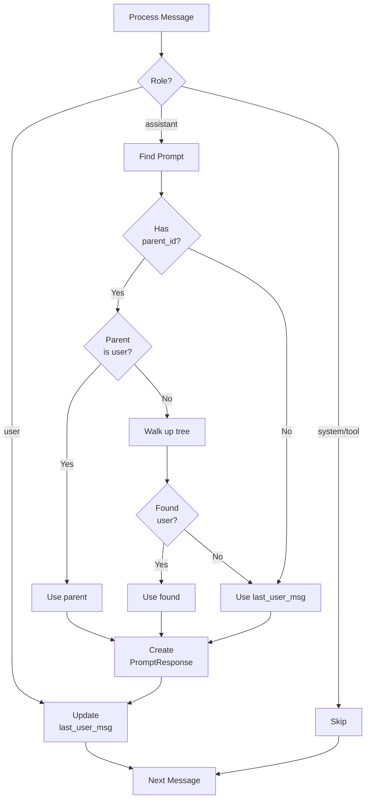
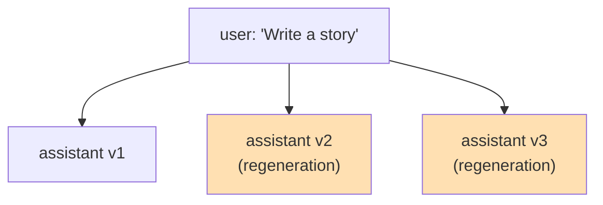

<!-- docs/builders.md -->
# Builders: Derived Data Construction

## Overview

Builders transform raw imported data into derived structures optimized for annotation and analysis. The current builder system focuses on creating prompt-response pairs directly from message parent-child relationships.

## PromptResponseBuilder

### Purpose

The `PromptResponseBuilder` creates direct user→assistant associations without depending on tree analysis. This is simpler and more robust than the previous exchange-based model.

### Key Features

- **Direct associations**: Uses `parent_id` for tree-aware pairing
- **Sequential fallback**: Falls back to most recent user message when parent_id unavailable
- **Handles regenerations**: Multiple responses can share the same prompt
- **Denormalized content**: Aggregates text content for efficient queries

### Data Model

```mermaid
erDiagram
    PromptResponse ||--|| Message : "prompt (user)"
    PromptResponse ||--|| Message : "response (assistant)"
    PromptResponse ||--|| PromptResponseContent : "has content"
    PromptResponse }o--|| Dialogue : "belongs to"
    
    PromptResponse {
        uuid id PK
        uuid dialogue_id FK
        uuid prompt_message_id FK
        uuid response_message_id FK
        int prompt_position
        int response_position
        string prompt_role
        string response_role
    }
    
    PromptResponseContent {
        uuid prompt_response_id PK_FK
        text prompt_text
        text response_text
        int prompt_word_count
        int response_word_count
    }
```

### Pairing Strategy



### Handling Regenerations

When a user regenerates an assistant response, ChatGPT creates multiple sibling messages with the same parent:



Each regeneration creates a separate `PromptResponse` record:
- All three records have the same `prompt_message_id`
- Each has a unique `response_message_id`
- Position tracking maintains sequential order

## Implementation

### Core Algorithm

```python
class PromptResponseBuilder:
    def build_for_dialogue(self, dialogue_id: UUID):
        # Get all messages ordered by created_at
        messages = (
            self.session.query(Message)
            .filter(Message.dialogue_id == dialogue_id)
            .filter(Message.deleted_at.is_(None))
            .order_by(Message.created_at.nulls_first(), Message.id)
            .all()
        )
        
        # Build lookup structures
        msg_by_id = {m.id: m for m in messages}
        position_by_id = {m.id: i for i, m in enumerate(messages)}
        
        # Track most recent user for sequential fallback
        last_user_msg = None
        
        for msg in messages:
            if msg.role == 'user':
                last_user_msg = msg
                continue
            
            # Find the prompt for this response
            prompt_msg = self._find_prompt(msg, msg_by_id, last_user_msg)
            
            if prompt_msg:
                self._create_prompt_response(
                    dialogue_id=dialogue_id,
                    prompt_msg=prompt_msg,
                    response_msg=msg,
                    prompt_position=position_by_id[prompt_msg.id],
                    response_position=position_by_id[msg.id],
                )
```

### Finding the Prompt

```python
def _find_prompt(
    self,
    response_msg: Message,
    msg_by_id: dict[UUID, Message],
    last_user_msg: Message | None,
) -> Message | None:
    """Find the user prompt that elicited this response."""
    
    # Strategy 1: Use parent_id if it points to a user message
    if response_msg.parent_id and response_msg.parent_id in msg_by_id:
        parent = msg_by_id[response_msg.parent_id]
        if parent.role == 'user':
            return parent
        
        # Parent exists but isn't user - walk up tree
        current = parent
        visited = {response_msg.id}
        while current and current.id not in visited:
            visited.add(current.id)
            if current.role == 'user':
                return current
            if current.parent_id and current.parent_id in msg_by_id:
                current = msg_by_id[current.parent_id]
            else:
                break
    
    # Strategy 2: Fall back to most recent user message
    return last_user_msg
```

### Content Aggregation

After creating prompt-response records, content is aggregated:

```python
def _build_content(self, dialogue_id: UUID) -> int:
    """Build content records for all prompt-responses in a dialogue."""
    result = self.session.execute(
        text("""
            INSERT INTO derived.prompt_response_content 
                (prompt_response_id, prompt_text, response_text, 
                 prompt_word_count, response_word_count)
            SELECT 
                pr.id,
                (SELECT string_agg(cp.text_content, ' ' ORDER BY cp.sequence)
                 FROM raw.content_parts cp 
                 WHERE cp.message_id = pr.prompt_message_id),
                (SELECT string_agg(cp.text_content, ' ' ORDER BY cp.sequence)
                 FROM raw.content_parts cp 
                 WHERE cp.message_id = pr.response_message_id),
                (SELECT sum(array_length(
                    string_to_array(cp.text_content, ' '), 1))
                 FROM raw.content_parts cp 
                 WHERE cp.message_id = pr.prompt_message_id),
                (SELECT sum(array_length(
                    string_to_array(cp.text_content, ' '), 1))
                 FROM raw.content_parts cp 
                 WHERE cp.message_id = pr.response_message_id)
            FROM derived.prompt_responses pr
            WHERE pr.dialogue_id = :dialogue_id
            ON CONFLICT (prompt_response_id) DO UPDATE SET
                prompt_text = EXCLUDED.prompt_text,
                response_text = EXCLUDED.response_text,
                prompt_word_count = EXCLUDED.prompt_word_count,
                response_word_count = EXCLUDED.response_word_count
        """),
        {'dialogue_id': dialogue_id}
    )
    return result.rowcount
```

## Build Modes

### Full Rebuild

Clears and rebuilds all prompt-responses:

```bash
# Rebuild all dialogues
llm-archive build_prompt_responses

# Rebuild specific dialogue
llm-archive build_prompt_responses --dialogue_id=<uuid>
```

```python
def build_all(self):
    """Rebuild all prompt-responses."""
    # Clear all existing
    self.session.execute(
        text("DELETE FROM derived.prompt_response_content")
    )
    self.session.execute(
        text("DELETE FROM derived.prompt_responses")
    )
    
    # Rebuild all dialogues
    dialogues = self.session.query(Dialogue.id).all()
    for (dialogue_id,) in dialogues:
        self.build_for_dialogue(dialogue_id)
    
    self.session.commit()
```

### Incremental Build

Builds only for new/updated dialogues:

```python
def build_incremental(self):
    """Build prompt-responses for dialogues without them."""
    # Find dialogues without prompt-responses
    dialogues_without_prs = (
        self.session.query(Dialogue.id)
        .outerjoin(PromptResponse, Dialogue.id == PromptResponse.dialogue_id)
        .filter(PromptResponse.id.is_(None))
        .all()
    )
    
    for (dialogue_id,) in dialogues_without_prs:
        self.build_for_dialogue(dialogue_id)
    
    self.session.commit()
```

## Edge Cases

### System Messages

System messages are typically not part of user→assistant pairs:

```python
# System message is skipped
if msg.role in ('system', 'tool', 'tool_result'):
    continue
```

### Empty Content

Messages with no content parts are still included:

```python
# Content may be NULL if message has no content_parts
prompt_text = None
response_text = None
```

### Tool Use

Tool use messages are treated as non-user, non-assistant messages:

```python
# Tool messages skipped, but assistant response after tool_result is paired
if msg.role in ('tool', 'tool_result'):
    continue
```

## Performance Considerations

### Batch Processing

```python
def build_all(self, batch_size: int = 100):
    """Build with periodic commits."""
    dialogues = self.session.query(Dialogue.id).all()
    
    for i, (dialogue_id,) in enumerate(dialogues):
        self.build_for_dialogue(dialogue_id)
        
        if (i + 1) % batch_size == 0:
            self.session.commit()
            logger.info(f"Processed {i + 1} dialogues")
    
    self.session.commit()
```

### Memory Efficiency

- Uses database-side text aggregation for content
- Processes one dialogue at a time
- Clears per-dialogue structures after processing

## Views

Several views provide convenient access to prompt-response data:

### prompt_response_content_v

Joins prompt_responses with their content for annotation:

```sql
CREATE VIEW derived.prompt_response_content_v AS
SELECT 
    pr.id as prompt_response_id,
    pr.dialogue_id,
    pr.prompt_message_id,
    pr.response_message_id,
    prc.prompt_text,
    prc.response_text,
    prc.prompt_word_count,
    prc.response_word_count,
    pr.prompt_role,
    pr.response_role,
    pr.prompt_position,
    pr.response_position
FROM derived.prompt_responses pr
LEFT JOIN derived.prompt_response_content prc 
    ON prc.prompt_response_id = pr.id;
```

### prompt_exchanges

Groups responses by their prompt (shows regenerations):

```sql
CREATE VIEW derived.prompt_exchanges AS
SELECT 
    prompt_message_id,
    dialogue_id,
    ARRAY_AGG(response_message_id ORDER BY response_position) as response_ids,
    COUNT(*) as response_count,
    COUNT(*) > 1 as has_regenerations,
    MIN(prompt_text) as prompt_text
FROM derived.prompt_responses pr
LEFT JOIN derived.prompt_response_content prc 
    ON prc.prompt_response_id = pr.id
GROUP BY prompt_message_id, dialogue_id;
```

## Testing

### Unit Tests

Test pairing logic with mock data:

```python
def test_find_prompt_uses_parent_id(builder, messages):
    """Test that parent_id takes precedence."""
    user_msg = messages[0]  # role='user'
    asst_msg = messages[1]  # role='assistant', parent_id=user_msg.id
    
    msg_by_id = {m.id: m for m in messages}
    prompt = builder._find_prompt(asst_msg, msg_by_id, user_msg)
    
    assert prompt.id == user_msg.id
```

### Integration Tests

Test full build with real database:

```python
def test_build_creates_prompt_responses(session, sample_dialogue):
    """Test building prompt-responses for a dialogue."""
    builder = PromptResponseBuilder(session)
    stats = builder.build_for_dialogue(sample_dialogue.id)
    
    assert stats['prompt_responses'] > 0
    
    # Verify records exist
    prs = session.query(PromptResponse).filter(
        PromptResponse.dialogue_id == sample_dialogue.id
    ).all()
    assert len(prs) == stats['prompt_responses']
```

## Related Documentation

- [Architecture Overview](architecture.md)
- [Schema Design](schema.md) - Prompt-response table definitions
- [Models](models.md) - PromptResponse SQLAlchemy model
- [Extractors](extractors.md) - Raw data source
- [Annotators](annotators.md) - Downstream annotation
