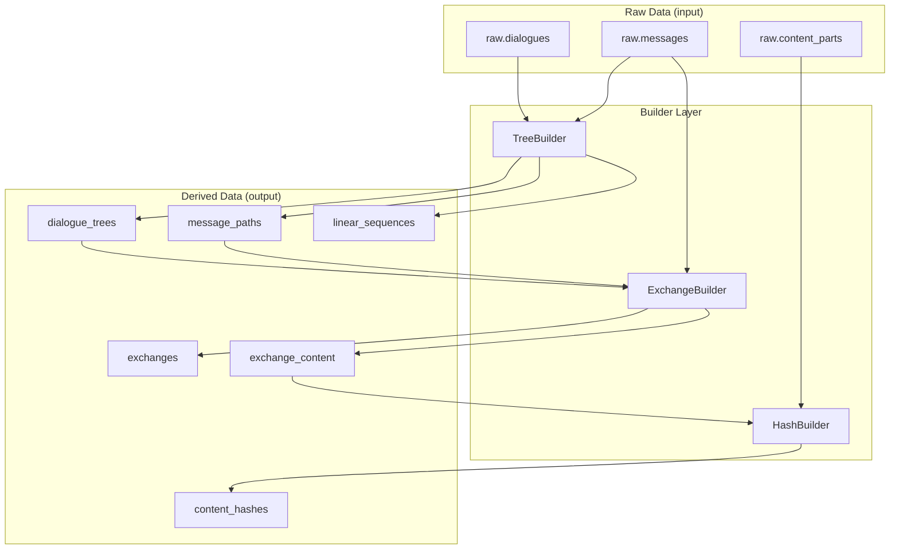
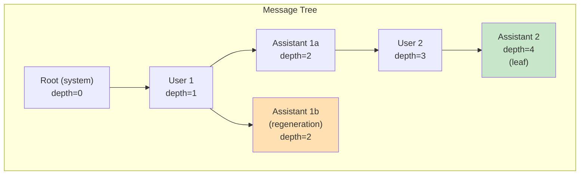
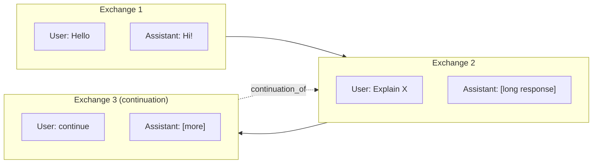

# docs/builders.md
# Derived Data Builders

## Overview

Builders transform raw imported data into derived structures that support efficient querying and analysis. They run after extraction to compute:

- **Tree Analysis**: Message paths, depths, branch detection
- **Linear Sequences**: Root-to-leaf paths for training/export
- **Exchanges**: User-assistant interaction pairs
- **Content Hashes**: Deduplication and change detection

## Builder Architecture



---

## Tree Builder

The `TreeBuilder` analyzes message tree structures to compute paths, depths, and branch information.

### Tree Concepts



**Key Terms:**
- **Root**: Message with no parent (`parent_id IS NULL`)
- **Leaf**: Message with no children
- **Branch Point**: Message with multiple children (regenerations)
- **Primary Path**: The "main" conversation (typically most recent/deepest)
- **Ancestor Path**: Array of message IDs from root to parent

### Builder API

```python
class TreeBuilder:
    """Builds derived tree structures from raw messages."""
    
    def __init__(self, session: Session):
        self.session = session
    
    def build(self, dialogue_id: UUID = None) -> dict[str, int]:
        """
        Build tree structures for dialogues.
        
        Args:
            dialogue_id: Optional - build for single dialogue
            
        Returns:
            {'trees': n, 'paths': n, 'sequences': n}
        """
    
    def build_incremental(self) -> dict[str, int]:
        """Build only for dialogues without existing tree analysis."""
```

### Algorithm: Path Computation

```python
def _compute_paths(self, dialogue_id: UUID, messages: list[Message]) -> list[MessagePath]:
    """Compute materialized paths for all messages."""
    paths = []
    
    # Build lookup structures
    by_id = {m.id: m for m in messages}
    children_of = defaultdict(list)
    for m in messages:
        if m.parent_id:
            children_of[m.parent_id].append(m.id)
    
    # Find root(s)
    roots = [m for m in messages if m.parent_id is None]
    
    # BFS to compute paths
    queue = [(root.id, []) for root in roots]
    
    while queue:
        msg_id, ancestor_path = queue.pop(0)
        children = children_of[msg_id]
        
        path = MessagePath(
            message_id=msg_id,
            dialogue_id=dialogue_id,
            ancestor_path=ancestor_path,
            depth=len(ancestor_path),
            is_root=len(ancestor_path) == 0,
            is_leaf=len(children) == 0,
            child_count=len(children),
            sibling_index=self._compute_sibling_index(msg_id, ancestor_path, children_of),
            is_on_primary_path=False,  # Set later
        )
        paths.append(path)
        
        # Queue children
        for child_id in children:
            queue.append((child_id, ancestor_path + [msg_id]))
    
    return paths
```

### Algorithm: Primary Path Selection

The primary path is the "main" conversation, selected by:
1. Find all leaf messages
2. Score each by: depth (primary) + recency (tiebreaker)
3. Trace back from best leaf to root

```python
def _select_primary_path(self, paths: list[MessagePath], messages: dict) -> set[UUID]:
    """Select the primary (main) conversation path."""
    # Find leaves
    leaves = [p for p in paths if p.is_leaf]
    
    if not leaves:
        return set()
    
    # Score leaves: prefer deeper, then more recent
    def score_leaf(path):
        msg = messages[path.message_id]
        timestamp = msg.source_created_at or msg.created_at or datetime.min
        return (path.depth, timestamp)
    
    best_leaf = max(leaves, key=score_leaf)
    
    # Trace back to root
    primary_ids = set(best_leaf.ancestor_path) | {best_leaf.message_id}
    
    return primary_ids
```

### Algorithm: Sequence Extraction

```python
def _extract_sequences(self, dialogue_id: UUID, paths: list[MessagePath]) -> list[LinearSequence]:
    """Extract all root-to-leaf paths as linear sequences."""
    sequences = []
    
    # Group by leaf
    leaves = [p for p in paths if p.is_leaf]
    
    for leaf_path in leaves:
        sequence = LinearSequence(
            dialogue_id=dialogue_id,
            leaf_message_id=leaf_path.message_id,
            sequence_length=leaf_path.depth + 1,
            is_primary=leaf_path.is_on_primary_path,
            branch_reason=self._detect_branch_reason(leaf_path, paths),
            branched_at_depth=self._find_branch_point(leaf_path, paths),
        )
        sequences.append(sequence)
        
        # Add sequence messages
        all_msg_ids = leaf_path.ancestor_path + [leaf_path.message_id]
        for position, msg_id in enumerate(all_msg_ids):
            seq_msg = SequenceMessage(
                sequence_id=sequence.id,
                message_id=msg_id,
                position=position,
            )
            self.session.add(seq_msg)
    
    return sequences
```

### Tree Analysis Output

```python
def _create_tree_analysis(self, dialogue_id: UUID, paths: list[MessagePath]) -> DialogueTree:
    """Create aggregate tree statistics."""
    branch_count = sum(1 for p in paths if p.child_count > 1)
    
    # Detect regenerations vs edits
    has_regenerations, has_edits = self._classify_branches(paths)
    
    # Find primary leaf
    primary_leaves = [p for p in paths if p.is_leaf and p.is_on_primary_path]
    primary_leaf = primary_leaves[0] if primary_leaves else None
    
    return DialogueTree(
        dialogue_id=dialogue_id,
        total_nodes=len(paths),
        max_depth=max(p.depth for p in paths) if paths else 0,
        branch_count=branch_count,
        leaf_count=sum(1 for p in paths if p.is_leaf),
        primary_leaf_id=primary_leaf.message_id if primary_leaf else None,
        primary_path_length=primary_leaf.depth + 1 if primary_leaf else None,
        has_regenerations=has_regenerations,
        has_edits=has_edits,
    )
```

---

## Exchange Builder

The `ExchangeBuilder` segments conversations into user-assistant exchange pairs.

### Exchange Definition

An **exchange** is a logical interaction unit:
- Starts with user message(s)
- Ends with assistant response(s)
- May include system/tool messages
- Tracks continuation patterns



### Builder API

```python
class ExchangeBuilder:
    """Builds exchanges from message trees."""
    
    def __init__(self, session: Session):
        self.session = session
    
    def build(self, dialogue_id: UUID = None) -> dict[str, int]:
        """
        Build exchanges for dialogues.
        
        Args:
            dialogue_id: Optional - build for single dialogue
            
        Returns:
            {'exchanges': n, 'content': n}
        """
    
    def build_incremental(self) -> dict[str, int]:
        """Build only for dialogues without existing exchanges."""
```

### Algorithm: Exchange Segmentation

```python
def _segment_exchanges(
    self,
    dialogue_id: UUID,
    messages: list[Message],
) -> list[Exchange]:
    """Segment a linear message sequence into exchanges."""
    exchanges = []
    current_exchange_msgs = []
    
    for message in messages:
        current_exchange_msgs.append(message)
        
        # Exchange ends when assistant finishes turn
        if message.role == 'assistant':
            # Check if this is end of turn
            if self._is_turn_complete(message, messages):
                exchange = self._create_exchange(
                    dialogue_id=dialogue_id,
                    messages=current_exchange_msgs,
                )
                exchanges.append(exchange)
                current_exchange_msgs = []
    
    # Handle incomplete exchange at end
    if current_exchange_msgs:
        exchange = self._create_exchange(
            dialogue_id=dialogue_id,
            messages=current_exchange_msgs,
        )
        exchanges.append(exchange)
    
    return exchanges
```

### Continuation Detection

Continuations are exchanges where the user's intent is to continue the previous response:

```python
CONTINUATION_PATTERNS = [
    r'^continue$',
    r'^go on$',
    r'^keep going$',
    r'^more$',
    r'^elaborate$',
    r'^\s*$',  # Empty/whitespace only
]

def _is_continuation(self, user_text: str) -> bool:
    """Detect if user message is a continuation prompt."""
    text = user_text.strip().lower()
    
    for pattern in CONTINUATION_PATTERNS:
        if re.match(pattern, text):
            return True
    
    return False

def _link_continuations(self, exchanges: list[Exchange]):
    """Link continuation exchanges to their predecessors."""
    for i, exchange in enumerate(exchanges):
        if i == 0:
            continue
        
        user_text = self._get_user_text(exchange)
        if self._is_continuation(user_text):
            exchange.is_continuation = True
            exchange.continuation_of_id = exchanges[i - 1].id
            
            # Update merged count on original
            original = exchanges[i - 1]
            while original.is_continuation and original.continuation_of_id:
                original = self._get_exchange(original.continuation_of_id)
            original.merged_count += 1
```

### Content Aggregation

```python
def _create_exchange_content(self, exchange: Exchange, messages: list[Message]) -> ExchangeContent:
    """Aggregate text content for an exchange."""
    user_parts = []
    assistant_parts = []
    
    for message in messages:
        text = self._extract_text_content(message)
        
        if message.role == 'user':
            user_parts.append(text)
        elif message.role == 'assistant':
            assistant_parts.append(text)
    
    user_text = '\n\n'.join(user_parts) if user_parts else None
    assistant_text = '\n\n'.join(assistant_parts) if assistant_parts else None
    full_text = '\n\n'.join(filter(None, [user_text, assistant_text]))
    
    return ExchangeContent(
        exchange_id=exchange.id,
        user_text=user_text,
        assistant_text=assistant_text,
        full_text=full_text,
        user_text_hash=self._hash_text(user_text),
        assistant_text_hash=self._hash_text(assistant_text),
        full_text_hash=self._hash_text(full_text),
        user_word_count=len(user_text.split()) if user_text else None,
        assistant_word_count=len(assistant_text.split()) if assistant_text else None,
        total_word_count=len(full_text.split()) if full_text else None,
    )
```

### Exchange-Sequence Linking

Exchanges are linked to sequences for training export:

```python
def _link_to_sequences(self, dialogue_id: UUID, exchanges: list[Exchange]):
    """Link exchanges to their containing sequences."""
    sequences = (
        self.session.query(LinearSequence)
        .filter(LinearSequence.dialogue_id == dialogue_id)
        .all()
    )
    
    for sequence in sequences:
        # Get messages in this sequence
        seq_msg_ids = set(
            sm.message_id for sm in 
            self.session.query(SequenceMessage.message_id)
            .filter(SequenceMessage.sequence_id == sequence.id)
            .all()
        )
        
        # Find exchanges that are fully contained in this sequence
        position = 0
        for exchange in exchanges:
            exchange_msg_ids = set(
                em.message_id for em in exchange.exchange_messages
            )
            
            if exchange_msg_ids.issubset(seq_msg_ids):
                link = SequenceExchange(
                    sequence_id=sequence.id,
                    exchange_id=exchange.id,
                    position=position,
                )
                self.session.add(link)
                position += 1
```

---

## Hash Builder

The `HashBuilder` computes content hashes for deduplication and change detection.

### Hash Types

| Scope | Description | Use Case |
|-------|-------------|----------|
| `full` | All content concatenated | Exact duplicate detection |
| `user` | User content only | Prompt deduplication |
| `assistant` | Assistant content only | Response deduplication |

### Builder API

```python
class HashBuilder:
    """Builds content hashes for deduplication."""
    
    def __init__(self, session: Session):
        self.session = session
    
    def build(
        self,
        entity_type: str = 'exchange',
        normalization: str = 'none',
    ) -> int:
        """
        Build content hashes for entities.
        
        Args:
            entity_type: 'message' or 'exchange'
            normalization: 'none', 'lowercase', 'whitespace'
            
        Returns:
            Number of hashes created
        """
```

### Normalization Options

```python
def _normalize_text(self, text: str, normalization: str) -> str:
    """Normalize text before hashing."""
    if normalization == 'none':
        return text
    
    if normalization == 'lowercase':
        return text.lower()
    
    if normalization == 'whitespace':
        # Collapse whitespace, normalize newlines
        text = re.sub(r'\s+', ' ', text)
        return text.strip()
    
    if normalization == 'full':
        # Lowercase + whitespace + remove punctuation
        text = text.lower()
        text = re.sub(r'\s+', ' ', text)
        text = re.sub(r'[^\w\s]', '', text)
        return text.strip()
    
    return text
```

### SimHash for Fuzzy Matching

Beyond SHA256 for exact matching, SimHash enables near-duplicate detection:

```python
def _compute_simhash(self, text: str) -> str:
    """Compute SimHash for fuzzy matching."""
    # Tokenize
    tokens = text.lower().split()
    
    # Compute hash vector
    v = [0] * 64
    for token in tokens:
        token_hash = int(hashlib.md5(token.encode()).hexdigest(), 16)
        for i in range(64):
            bit = (token_hash >> i) & 1
            v[i] += 1 if bit else -1
    
    # Convert to fingerprint
    fingerprint = 0
    for i in range(64):
        if v[i] > 0:
            fingerprint |= (1 << i)
    
    return format(fingerprint, '016x')
```

---

## Build Pipeline

### Full Rebuild

```python
def rebuild_derived(session: Session, dialogue_id: UUID = None):
    """Rebuild all derived structures."""
    tree_builder = TreeBuilder(session)
    exchange_builder = ExchangeBuilder(session)
    hash_builder = HashBuilder(session)
    
    # Clear existing derived data
    if dialogue_id:
        _clear_derived_for_dialogue(session, dialogue_id)
    else:
        _clear_all_derived(session)
    
    # Build in order
    tree_results = tree_builder.build(dialogue_id)
    exchange_results = exchange_builder.build(dialogue_id)
    hash_results = hash_builder.build()
    
    session.commit()
    
    return {**tree_results, **exchange_results, 'hashes': hash_results}
```

### Incremental Build

```python
def build_incremental(session: Session):
    """Build derived structures for new dialogues only."""
    tree_builder = TreeBuilder(session)
    exchange_builder = ExchangeBuilder(session)
    
    # Find dialogues without tree analysis
    new_dialogues = (
        session.query(Dialogue.id)
        .outerjoin(DialogueTree)
        .filter(DialogueTree.dialogue_id.is_(None))
        .all()
    )
    
    for (dialogue_id,) in new_dialogues:
        tree_builder.build(dialogue_id)
        exchange_builder.build(dialogue_id)
    
    session.commit()
```

---

## Performance Considerations

### Batch Processing

```python
def build(self, dialogue_id: UUID = None, batch_size: int = 100):
    """Build with batch commits."""
    dialogues = self._get_dialogues(dialogue_id)
    
    for i, dialogue in enumerate(dialogues):
        self._process_dialogue(dialogue)
        
        if (i + 1) % batch_size == 0:
            self.session.commit()
            logger.info(f"Processed {i + 1} dialogues")
    
    self.session.commit()
```

### Memory-Efficient Iteration

```python
def _iter_dialogues(self):
    """Iterate dialogues without loading all into memory."""
    query = self.session.query(Dialogue.id)
    
    # Use server-side cursor
    for (dialogue_id,) in query.yield_per(1000):
        yield dialogue_id
```

---

## Related Documentation

- [Architecture Overview](architecture.md)
- [Schema Design](schema.md) - Derived table definitions
- [Models](models.md) - SQLAlchemy models
- [Extractors](extractors.md) - Raw data source
- [Annotators](annotators.md) - Post-building analysis