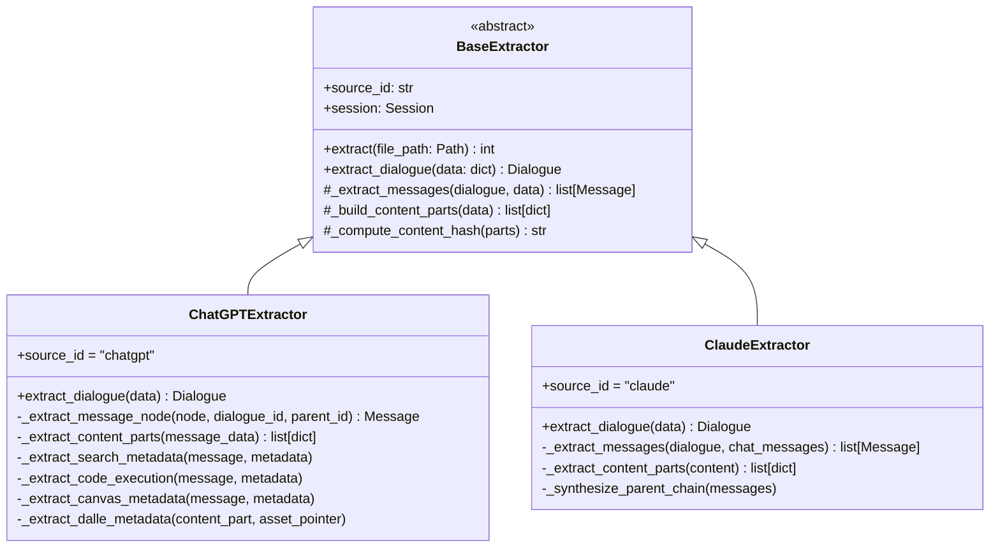
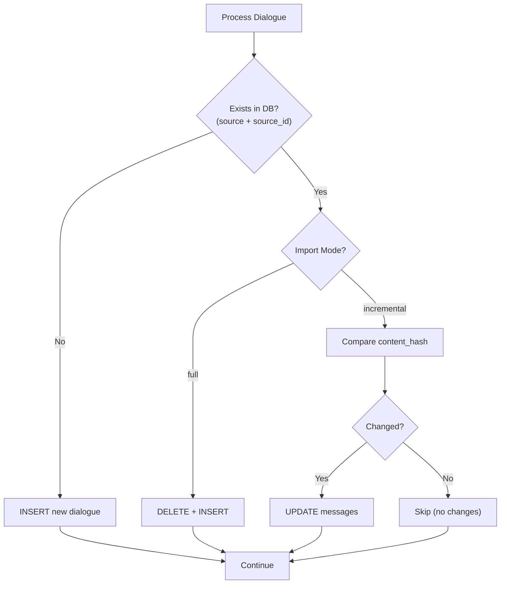
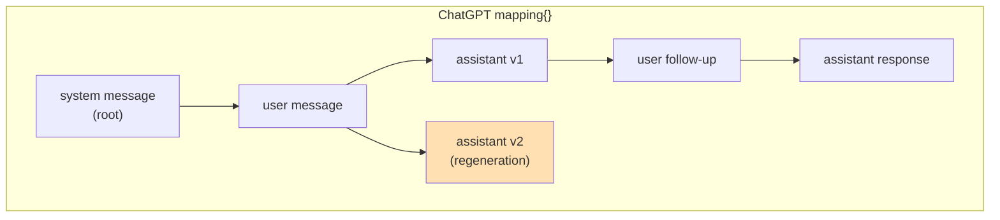
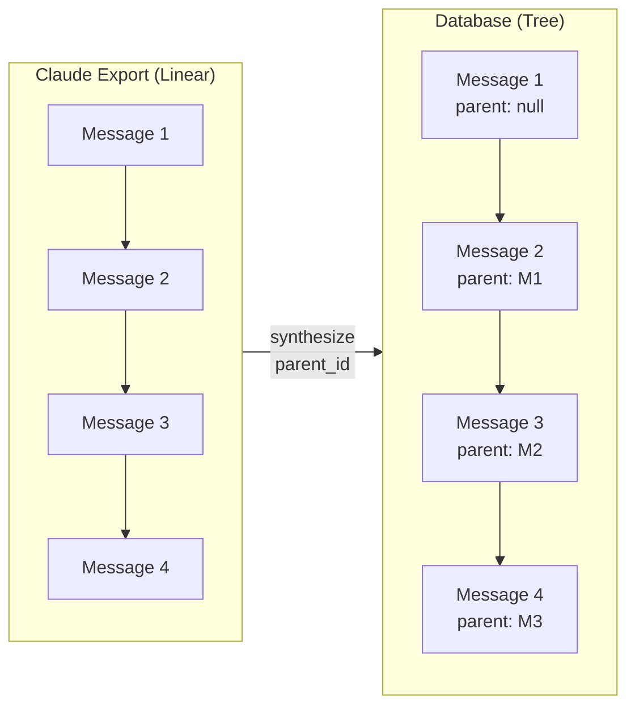
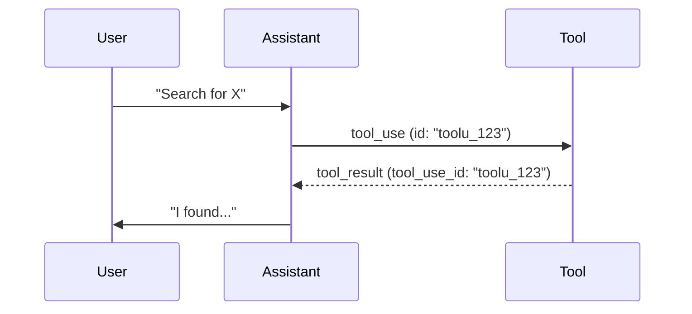
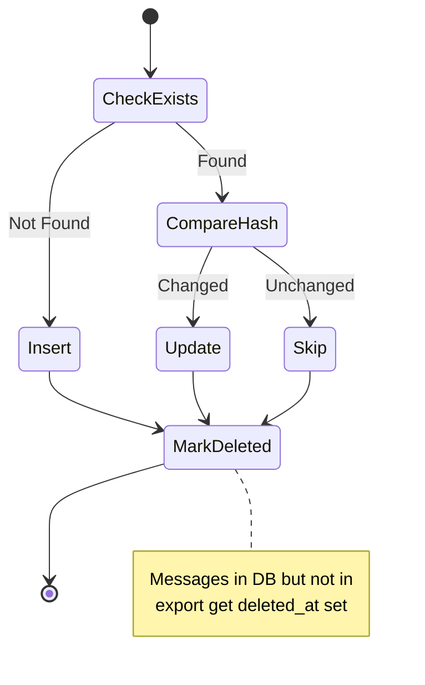

# docs/extractors.md
# Data Extraction System

## Overview

Extractors transform platform-specific export formats into the universal raw schema. Each extractor handles the idiosyncrasies of its source platform while producing consistent output that can be processed by downstream builders and annotators.

## Architecture



## Base Extractor

The `BaseExtractor` class provides common functionality for all extractors:

### Core Interface

```python
class BaseExtractor(ABC):
    """Base class for platform-specific extractors."""
    
    source_id: str = None  # Override in subclass: 'chatgpt', 'claude'
    
    def __init__(self, session: Session):
        self.session = session
    
    def extract(
        self,
        file_path: Path,
        mode: str = 'full',      # 'full' | 'incremental'
        batch_size: int = 1000,
    ) -> int:
        """
        Extract dialogues from export file.
        
        Args:
            file_path: Path to export JSON file
            mode: 'full' replaces existing, 'incremental' updates only
            batch_size: Messages per batch insert
            
        Returns:
            Number of dialogues processed
        """
    
    @abstractmethod
    def extract_dialogue(self, data: dict) -> Dialogue:
        """Extract a single dialogue from source data."""
        pass
```

### Deduplication Strategy



### Content Hashing

Content hashes enable efficient change detection:

```python
def _compute_content_hash(self, content_parts: list[dict]) -> str:
    """Compute SHA256 hash of message content for change detection."""
    # Normalize content for consistent hashing
    normalized = []
    for part in sorted(content_parts, key=lambda p: p.get('sequence', 0)):
        normalized.append({
            'type': part.get('part_type'),
            'text': part.get('text_content', ''),
            'language': part.get('language'),
        })
    
    content_str = json.dumps(normalized, sort_keys=True)
    return hashlib.sha256(content_str.encode()).hexdigest()
```

---

## ChatGPT Extractor

### Export Format

ChatGPT exports are ZIP files containing:
- `conversations.json` - Array of conversation objects
- `message_feedback.json` - User feedback (not currently extracted)
- Various media files

### Conversation Structure

```json
{
  "id": "abc123",
  "title": "Conversation Title",
  "create_time": 1699900000.0,
  "update_time": 1699900100.0,
  "mapping": {
    "node-id-1": {
      "id": "node-id-1",
      "parent": null,
      "children": ["node-id-2"],
      "message": {
        "id": "msg-id-1",
        "author": {"role": "system"},
        "content": {"content_type": "text", "parts": ["..."]},
        "create_time": 1699900000.0,
        "metadata": {...}
      }
    },
    "node-id-2": {...}
  },
  "current_node": "node-id-final",
  "gizmo_id": "g-xxx"  // Custom GPT identifier
}
```

### Tree Extraction

ChatGPT conversations are stored as trees in a `mapping` dictionary:



```python
def _extract_message_tree(self, dialogue: Dialogue, mapping: dict) -> list[Message]:
    """Extract messages preserving tree structure."""
    messages = []
    
    # Build ID mapping for parent references
    source_to_db_id = {}
    
    # Process in topological order (parents before children)
    for node_id in self._topological_sort(mapping):
        node = mapping[node_id]
        
        if not node.get('message'):
            continue  # Skip empty nodes
        
        parent_source_id = node.get('parent')
        parent_db_id = source_to_db_id.get(parent_source_id)
        
        message = self._extract_message_node(
            node=node,
            dialogue_id=dialogue.id,
            parent_id=parent_db_id,
        )
        
        messages.append(message)
        source_to_db_id[node_id] = message.id
    
    return messages
```

### Content Part Extraction

```python
def _extract_content_parts(self, message_data: dict) -> list[dict]:
    """Extract content parts from ChatGPT message."""
    content = message_data.get('content', {})
    content_type = content.get('content_type', 'text')
    parts = []
    
    if content_type == 'text':
        # Text content: parts is array of strings
        for i, text in enumerate(content.get('parts', [])):
            parts.append({
                'sequence': i,
                'part_type': 'text',
                'text_content': text,
                'source_json': {'type': 'text', 'text': text},
            })
    
    elif content_type == 'code':
        # Code block with language
        parts.append({
            'sequence': 0,
            'part_type': 'code',
            'text_content': content.get('text', ''),
            'language': content.get('language'),
            'source_json': content,
        })
    
    elif content_type == 'multimodal_text':
        # Mixed content: text, images, files
        for i, part in enumerate(content.get('parts', [])):
            if isinstance(part, str):
                parts.append({
                    'sequence': i,
                    'part_type': 'text',
                    'text_content': part,
                })
            elif isinstance(part, dict):
                # Image or file reference
                parts.append(self._extract_multimodal_part(i, part))
    
    return parts
```

### Platform Feature Extraction

#### Web Search

```python
def _extract_search_metadata(self, message: Message, metadata: dict):
    """Extract web search results into extension tables."""
    search_groups = metadata.get('search_result_groups', [])
    
    for group_data in search_groups:
        group = ChatGPTSearchGroup(
            message_id=message.id,
            group_type=group_data.get('group_type'),
            domain=group_data.get('domain'),
            source_json=group_data,
        )
        self.session.add(group)
        
        for i, entry in enumerate(group_data.get('entries', [])):
            search_entry = ChatGPTSearchEntry(
                group_id=group.id,
                sequence=i,
                url=entry.get('url'),
                title=entry.get('title'),
                snippet=entry.get('snippet'),
                source_json=entry,
            )
            self.session.add(search_entry)
```

#### Code Execution

```python
def _extract_code_execution(self, message: Message, metadata: dict):
    """Extract Code Interpreter execution data."""
    aggregate_result = metadata.get('aggregate_result', {})
    
    for run_data in aggregate_result.get('runs', []):
        execution = ChatGPTCodeExecution(
            message_id=message.id,
            run_id=run_data.get('id'),
            status=run_data.get('status'),
            code=run_data.get('code'),
            started_at=self._parse_timestamp(run_data.get('start_time')),
            ended_at=self._parse_timestamp(run_data.get('end_time')),
            final_output=run_data.get('final_output'),
            exception_name=run_data.get('exception', {}).get('name'),
            exception_traceback=run_data.get('exception', {}).get('traceback'),
            source_json=run_data,
        )
        self.session.add(execution)
        
        for i, output in enumerate(run_data.get('outputs', [])):
            code_output = ChatGPTCodeOutput(
                execution_id=execution.id,
                sequence=i,
                output_type=output.get('type'),
                stream_name=output.get('stream'),
                text_content=output.get('text'),
                image_url=output.get('image_url'),
                source_json=output,
            )
            self.session.add(code_output)
```

---

## Claude Extractor

### Export Format

Claude exports are JSON files with this structure:

```json
{
  "uuid": "conversation-uuid",
  "name": "Conversation Title",
  "created_at": "2024-01-15T10:30:00Z",
  "updated_at": "2024-01-15T11:45:00Z",
  "chat_messages": [
    {
      "uuid": "message-uuid",
      "sender": "human",
      "created_at": "2024-01-15T10:30:00Z",
      "updated_at": "2024-01-15T10:30:00Z",
      "content": [
        {"type": "text", "text": "Hello!"}
      ],
      "attachments": []
    },
    {
      "uuid": "message-uuid-2",
      "sender": "assistant",
      "created_at": "2024-01-15T10:30:05Z",
      "content": [
        {"type": "text", "text": "Hello! How can I help?"}
      ]
    }
  ]
}
```

### Linear to Tree Conversion

Claude exports are linear (no branching). The extractor synthesizes parent-child relationships:



```python
def _synthesize_parent_chain(self, messages: list[Message]):
    """Add parent_id to create linear tree structure."""
    for i, message in enumerate(messages):
        if i > 0:
            message.parent_id = messages[i - 1].id
```

### Content Part Extraction

```python
def _extract_content_parts(self, content: list[dict]) -> list[dict]:
    """Extract content parts from Claude message content array."""
    parts = []
    
    for i, item in enumerate(content):
        content_type = item.get('type', 'text')
        
        if content_type == 'text':
            parts.append({
                'sequence': i,
                'part_type': 'text',
                'text_content': item.get('text', ''),
                'source_json': item,
            })
        
        elif content_type == 'tool_use':
            parts.append({
                'sequence': i,
                'part_type': 'tool_use',
                'tool_name': item.get('name'),
                'tool_use_id': item.get('id'),
                'tool_input': item.get('input'),
                'source_json': item,
            })
        
        elif content_type == 'tool_result':
            parts.append({
                'sequence': i,
                'part_type': 'tool_result',
                'tool_use_id': item.get('tool_use_id'),
                'text_content': self._extract_tool_result_text(item),
                'is_error': item.get('is_error', False),
                'source_json': item,
            })
        
        elif content_type == 'image':
            parts.append({
                'sequence': i,
                'part_type': 'image',
                'media_type': item.get('source', {}).get('media_type'),
                'url': item.get('source', {}).get('url'),
                'source_json': item,
            })
        
        elif content_type == 'thinking':
            parts.append({
                'sequence': i,
                'part_type': 'thinking',
                'text_content': item.get('thinking', ''),
                'source_json': item,
            })
    
    return parts
```

### Tool Use Correlation

Claude's tool use requires correlating `tool_use` with `tool_result`:



```python
def _correlate_tool_use(self, messages: list[Message]):
    """Link tool_result parts back to their tool_use parts."""
    tool_uses = {}  # tool_use_id -> ContentPart
    
    for message in messages:
        for part in message.content_parts:
            if part.part_type == 'tool_use':
                tool_uses[part.tool_use_id] = part
            elif part.part_type == 'tool_result':
                # The tool_use_id field already links them
                # But we can add additional correlation if needed
                pass
```

---

## Import Modes

### Full Import

Replaces all existing data for the source:

```python
extractor.extract(file_path, mode='full')
```

1. Delete existing dialogues with matching `source_id`
2. Insert all dialogues from file
3. Rebuild derived structures

### Incremental Import

Updates only changed data:

```python
extractor.extract(file_path, mode='incremental')
```

1. Check if dialogue exists (by `source` + `source_id`)
2. If new: INSERT
3. If exists: Compare `content_hash`
4. If changed: UPDATE messages
5. Mark missing messages as `deleted_at`



---

## Error Handling

### Malformed Data

```python
def extract_dialogue(self, data: dict) -> Dialogue | None:
    """Extract dialogue, handling malformed data gracefully."""
    try:
        source_id = data.get('id')
        if not source_id:
            logger.warning("Dialogue missing 'id' field, skipping")
            return None
        
        dialogue = Dialogue(
            source=self.source_id,
            source_id=source_id,
            title=data.get('title'),
            source_json=data,
        )
        
        # Extract messages...
        
        return dialogue
        
    except Exception as e:
        logger.error(f"Failed to extract dialogue {data.get('id')}: {e}")
        return None
```

### Transaction Safety

```python
def extract(self, file_path: Path, ...) -> int:
    """Extract with transaction safety."""
    count = 0
    
    with open(file_path) as f:
        conversations = json.load(f)
    
    for data in conversations:
        try:
            dialogue = self.extract_dialogue(data)
            if dialogue:
                self.session.add(dialogue)
                count += 1
                
                # Batch commits
                if count % 100 == 0:
                    self.session.commit()
                    
        except Exception as e:
            logger.error(f"Failed: {e}")
            self.session.rollback()
            continue
    
    self.session.commit()
    return count
```

---

## Adding a New Extractor

### Step 1: Create Extractor Class

```python
# llm_archive/extractors/new_platform.py

class NewPlatformExtractor(BaseExtractor):
    """Extractor for NewPlatform exports."""
    
    source_id = 'new_platform'
    
    def extract_dialogue(self, data: dict) -> Dialogue:
        # 1. Create Dialogue object
        dialogue = Dialogue(
            source=self.source_id,
            source_id=data['conversation_id'],
            title=data.get('title'),
            source_created_at=parse_timestamp(data.get('created')),
            source_json=data,
        )
        
        # 2. Extract messages
        messages = self._extract_messages(dialogue, data['messages'])
        
        # 3. Establish tree structure
        self._build_parent_chain(messages)
        
        # 4. Extract platform-specific features
        self._extract_platform_features(messages, data)
        
        return dialogue
```

### Step 2: Add Source Entry

```sql
INSERT INTO raw.sources (id, display_name, has_native_trees, role_vocabulary)
VALUES ('new_platform', 'New Platform', false, ARRAY['user', 'assistant']);
```

### Step 3: Create Extension Tables (if needed)

```sql
CREATE TABLE raw.new_platform_message_meta (
    message_id uuid PRIMARY KEY REFERENCES raw.messages ON DELETE CASCADE,
    custom_field text,
    source_json jsonb NOT NULL
);
```

### Step 4: Register in CLI

```python
# llm_archive/cli.py

EXTRACTORS = {
    'chatgpt': ChatGPTExtractor,
    'claude': ClaudeExtractor,
    'new_platform': NewPlatformExtractor,
}
```

---

## Related Documentation

- [Architecture Overview](architecture.md)
- [Schema Design](schema.md)
- [Models](models.md)
- [Builders](builders.md) - Post-extraction processing