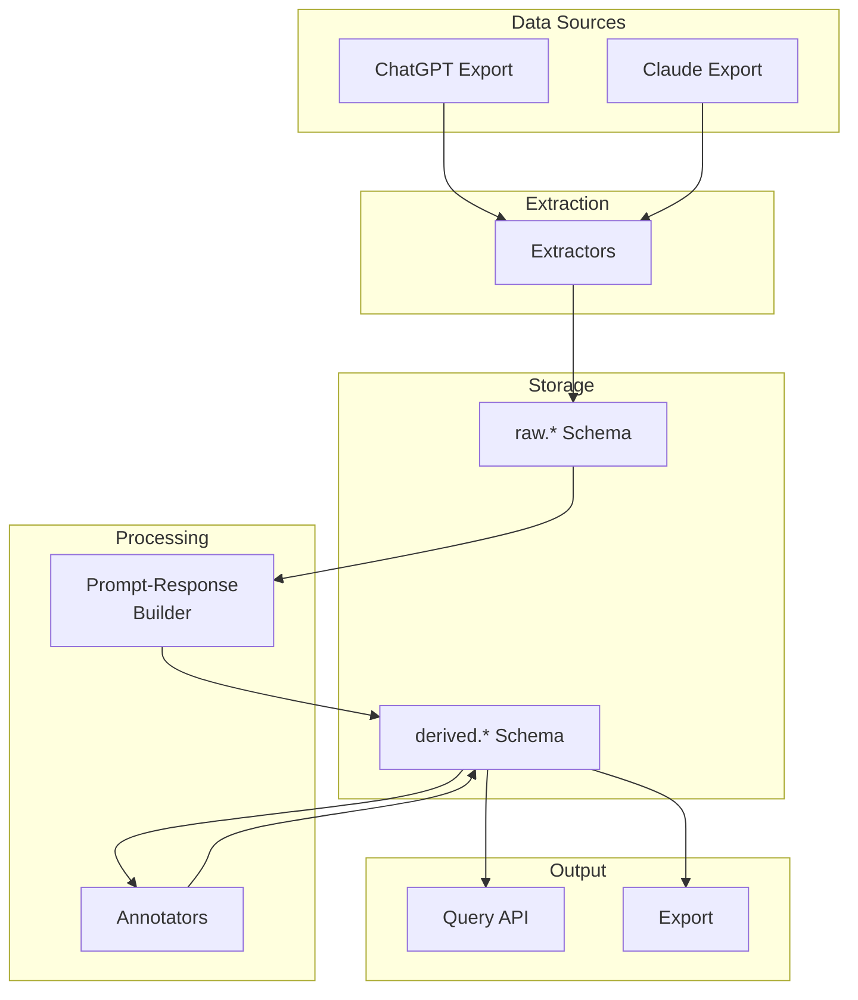
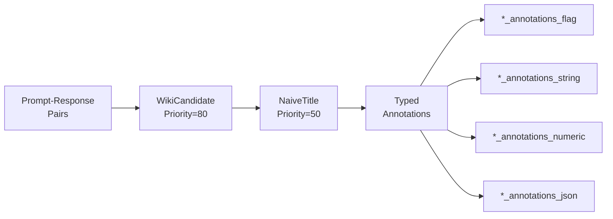
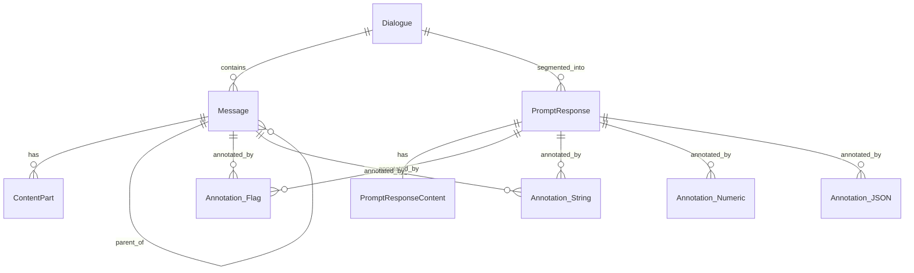
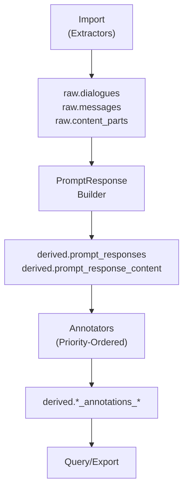

<!-- docs/index.md -->
# LLM Archive Documentation

## Overview

LLM Archive is a system for importing, normalizing, analyzing, and annotating conversation data from multiple LLM platforms. It transforms heterogeneous export formats into a unified data model optimized for annotation and downstream analysis.

## Quick Start

```bash
# Initialize database
llm-archive init --schema_dir=schema

# Import conversations
llm-archive import_chatgpt conversations.json
llm-archive import_claude claude_export.json

# Build prompt-response pairs
llm-archive build_prompt_responses

# Run annotations
llm-archive annotate

# View statistics
llm-archive stats
```

## Documentation Guide

### System Design

| Document | Description |
|----------|-------------|
| [Architecture](architecture.md) | High-level system design, data flow, component responsibilities |
| [Schema](schema.md) | Database schema design for raw and derived tables |
| [Models](models.md) | SQLAlchemy ORM models and relationships |

### Components

| Document | Description |
|----------|-------------|
| [Extractors](extractors.md) | Platform-specific data extraction (ChatGPT, Claude) |
| [Builders](builders.md) | Derived data construction (prompt-responses) |
| [Annotators](annotators.md) | Typed annotation system with strategy pattern |
| [CLI](cli.md) | Command-line interface reference |
| [Testing](testing.md) | Testing strategy and guidelines |

## Architecture Overview



## Key Concepts

### Two-Schema Architecture

- **raw.\***: Immutable imported data with full source fidelity
- **derived.\***: Computed structures that can be rebuilt

### Prompt-Response Model

- Fundamental interaction unit: user prompt + assistant response
- Direct parent-child associations without tree dependency
- Each response associated with exactly one prompt
- Prompts can have multiple responses (regenerations)

### Typed Annotation System

- Separate tables per (entity_type, value_type) combination
- Four value types: `flag`, `string`, `numeric`, `json`
- Four entity types: `content_part`, `message`, `prompt_response`, `dialogue`
- Cursor-based incremental processing
- Multiple strategies can target the same semantic concept with priority ordering

## Module Structure

```
llm_archive/
├── models/
│   ├── raw.py              # Raw schema models
│   └── derived.py          # Derived schema models
├── extractors/
│   ├── base.py             # Base extractor class
│   ├── chatgpt.py          # ChatGPT extractor
│   └── claude.py           # Claude extractor
├── builders/
│   └── prompt_response.py  # Prompt-response builder
├── annotations/
│   └── core.py             # AnnotationWriter/Reader
├── annotators/
│   └── prompt_response.py  # Prompt-response annotators
├── cli.py                  # Command-line interface
└── config.py               # Environment configuration
```

## Schema Layers

### Raw Schema (`raw.*`)

- Sources registry
- Dialogues (conversations)
- Messages (with tree structure via parent_id)
- Content parts (text, code, images, tool use)
- Platform-specific extensions (ChatGPT search, code execution, DALL-E, etc.)

### Derived Schema (`derived.*`)

- Prompt-response pairs and content
- Typed annotation tables
- Views for querying annotated content
- Annotator cursor tracking

## Annotation Workflow



## Entity Relationships



## Processing Pipeline



## Getting Started

1. **Setup**: Initialize database and import data
2. **Build**: Create prompt-response pairs
3. **Annotate**: Run annotators to classify and tag content
4. **Query**: Use views and annotations to find specific content
5. **Export**: Extract processed data for downstream use

## Support

- **GitHub Issues**: Bug reports and feature requests
- **Documentation**: This docs/ folder
- **Tests**: tests/ folder for examples and integration patterns

## Version History

See CHANGELOG.md for release notes.
