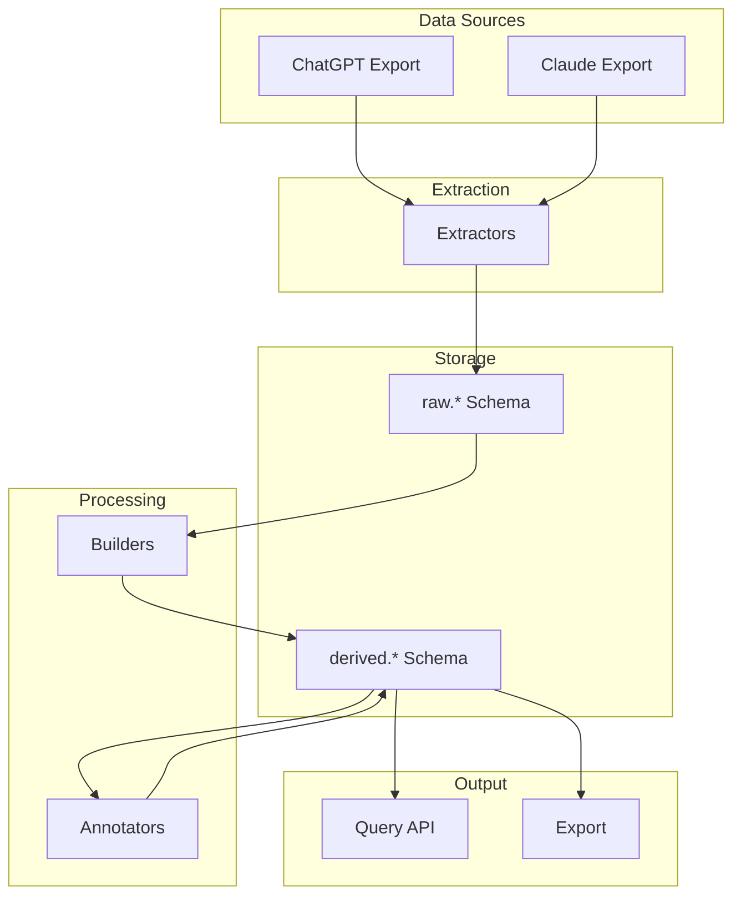
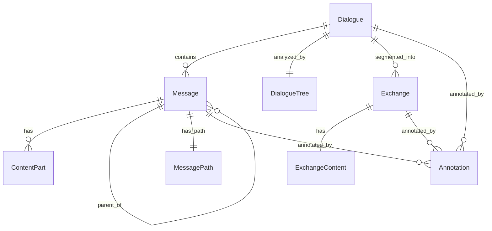
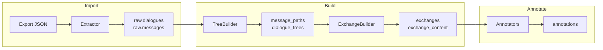

# docs/index.md
# LLM Archive Documentation

## Overview

LLM Archive is a system for importing, normalizing, analyzing, and annotating conversation data from multiple LLM platforms. It transforms heterogeneous export formats into a unified data model that supports both tree-structured and linear conversation representations.

## Quick Start

```bash
# Initialize database
llm-archive init-db

# Import conversations
llm-archive import chatgpt conversations.json

# Build derived structures
llm-archive build all

# Run annotations
llm-archive annotate all

# View statistics
llm-archive stats
```

## Documentation Guide

### System Design

| Document | Description |
|----------|-------------|
| [Architecture](architecture.md) | High-level system design, data flow, component responsibilities |
| [Schema](schema.md) | Database schema design for raw and derived tables |
| [Models](models.md) | SQLAlchemy ORM models and relationships |

### Components

| Document | Description |
|----------|-------------|
| [Extractors](extractors.md) | Platform-specific data extraction (ChatGPT, Claude) |
| [Builders](builders.md) | Derived data construction (trees, exchanges, hashes) |
| [Annotators](annotators.md) | Annotation system with strategy pattern |
| [CLI](cli.md) | Command-line interface reference |

## Architecture Overview



## Key Concepts

### Two-Schema Architecture

- **raw.\***: Immutable imported data with full source fidelity
- **derived.\***: Computed structures that can be rebuilt

### Tree-Native Design

- Messages form a tree (parent-child relationships)
- Supports ChatGPT's regeneration/edit branches
- Linear sequences extracted for training export

### Exchange Model

- Fundamental interaction unit: user prompt + assistant response
- Supports continuation detection and merging
- Aggregated content for efficient querying

### Strategy Pattern for Annotations

- Multiple annotators can target the same semantic concept
- Priority-based execution (higher runs first)
- Platform ground truth (priority=100) vs heuristics (priority=30)

## Module Structure

```
llm_archive/
├── models/
│   ├── raw.py          # Raw schema models
│   └── derived.py      # Derived schema models
├── extractors/
│   ├── base.py         # Base extractor class
│   ├── chatgpt.py      # ChatGPT extractor
│   └── claude.py       # Claude extractor
├── builders/
│   ├── trees.py        # Tree analysis
│   ├── exchanges.py    # Exchange segmentation
│   └── hashes.py       # Content hashing
├── annotators/
│   ├── base.py         # Base classes, manager
│   ├── message.py      # Message annotators
│   ├── exchange.py     # Exchange annotators
│   ├── dialogue.py     # Dialogue annotators
│   └── chatgpt.py      # ChatGPT platform annotators
├── cli.py              # Command-line interface
├── db.py               # Database connection
└── config.py           # Configuration
```

## Common Tasks

### Import New Data

```bash
# ChatGPT (from GDPR export zip)
unzip chatgpt_export.zip
llm-archive import chatgpt conversations.json

# Claude
llm-archive import claude claude_conversations.json
```

### Add Custom Annotator

```python
from llm_archive.annotators import MessageTextAnnotator, MessageTextData, AnnotationResult

class MyAnnotator(MessageTextAnnotator):
    ANNOTATION_TYPE = 'tag'
    ANNOTATION_KEY = 'my_feature'
    PRIORITY = 50
    VERSION = '1.0'
    
    def annotate(self, data: MessageTextData) -> list[AnnotationResult]:
        if 'pattern' in data.text:
            return [AnnotationResult(value='has_pattern', confidence=0.9)]
        return []

# Register and run
manager.register(MyAnnotator)
manager.run_all()
```

### Export for Training

```bash
llm-archive export exchanges training_data.jsonl \
    --format jsonl \
    --has-tag coding \
    --min-assistant-words 100 \
    --primary-only
```

### Query Annotations

```python
from llm_archive.annotators import AnnotationManager

manager = AnnotationManager(session)

# Get all tags for an exchange
tags = manager.get_tags('exchange', exchange_id)

# Get exchanges with specific annotation
annotations = manager.get_annotations(
    entity_type='exchange',
    annotation_type='tag',
    annotation_key='exchange_type',
)
```

## Diagrams

### Entity Relationships



### Processing Pipeline



## Support

- GitHub Issues: Bug reports and feature requests
- Documentation: This docs/ folder
- Tests: tests/ folder for examples

## Version History

See CHANGELOG.md for release notes.