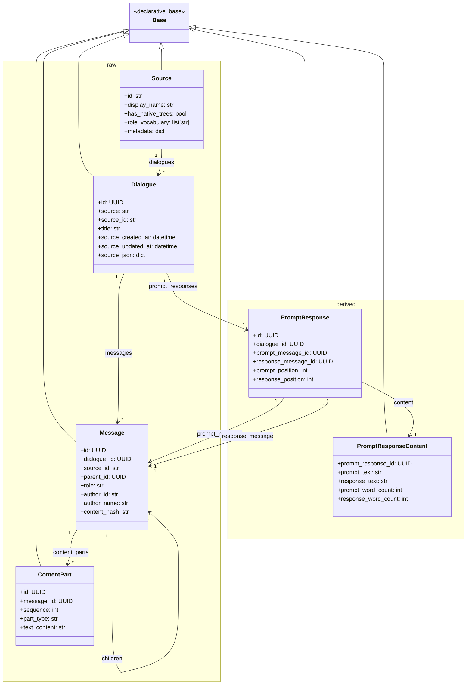

<!-- docs/models.md -->
# SQLAlchemy Models

## Overview

The ORM layer provides Python classes that map to database tables, enabling type-safe data access and relationship navigation. Models are organized into two modules mirroring the database schemas:

- `models/raw.py` - Raw schema models (imports)
- `models/derived.py` - Derived schema models (computed)

## Model Organization



## Raw Models (`models/raw.py`)

### Core Models

#### Source

```python
class Source(Base):
    """Registry of dialogue sources."""
    __tablename__ = "sources"
    __table_args__ = {"schema": "raw"}
    
    id = Column(String, primary_key=True)
    display_name = Column(String, nullable=False)
    has_native_trees = Column(Boolean, nullable=False)
    role_vocabulary = Column(ARRAY(String), nullable=False)
    source_metadata = Column(JSONB, name="metadata")
    
    # Relationships
    dialogues = relationship("Dialogue", back_populates="source_rel")
```

**Usage:**
```python
# Check if source supports tree structure
if source.has_native_trees:
    # Handle ChatGPT-style branching
    pass
    
# Validate role
if message.role not in source.role_vocabulary:
    raise ValueError(f"Invalid role: {message.role}")
```

#### Dialogue

```python
class Dialogue(Base):
    """Universal dialogue container."""
    __tablename__ = "dialogues"
    __table_args__ = {"schema": "raw"}
    
    id = Column(PG_UUID(as_uuid=True), primary_key=True, 
                server_default=func.gen_random_uuid())
    source = Column(String, ForeignKey("raw.sources.id"), nullable=False)
    source_id = Column(String, nullable=False)
    
    title = Column(String)
    
    # Source timestamps (from archive)
    source_created_at = Column(DateTime(timezone=True))
    source_updated_at = Column(DateTime(timezone=True))
    
    source_json = Column(JSONB, nullable=False)
    
    # DB timestamps
    created_at = Column(DateTime(timezone=True), server_default=func.now())
    updated_at = Column(DateTime(timezone=True), server_default=func.now())
    
    # Relationships
    source_rel = relationship("Source", back_populates="dialogues")
    messages = relationship("Message", back_populates="dialogue", 
                          cascade="all, delete-orphan")
    prompt_responses = relationship("PromptResponse", back_populates="dialogue",
                                  cascade="all, delete-orphan")
```

**Usage:**
```python
# Get all messages
for message in dialogue.messages:
    print(f"{message.role}: {message.content_parts[0].text_content}")

# Get prompt-response pairs
for pr in dialogue.prompt_responses:
    print(f"Q: {pr.content.prompt_text}")
    print(f"A: {pr.content.response_text}")
```

#### Message

```python
class Message(Base):
    """Universal message with tree structure support."""
    __tablename__ = "messages"
    __table_args__ = {"schema": "raw"}
    
    id = Column(PG_UUID(as_uuid=True), primary_key=True,
                server_default=func.gen_random_uuid())
    dialogue_id = Column(PG_UUID(as_uuid=True), 
                        ForeignKey("raw.dialogues.id", ondelete="CASCADE"),
                        nullable=False)
    source_id = Column(String, nullable=False)
    
    # Tree structure
    parent_id = Column(PG_UUID(as_uuid=True), ForeignKey("raw.messages.id"))
    
    # Normalized fields
    role = Column(String, nullable=False)
    author_id = Column(String)
    author_name = Column(String)
    
    # Source timestamps
    source_created_at = Column(DateTime(timezone=True))
    source_updated_at = Column(DateTime(timezone=True))
    
    # Change tracking
    content_hash = Column(String)
    deleted_at = Column(DateTime(timezone=True))
    
    source_json = Column(JSONB, nullable=False)
    
    # DB timestamps
    created_at = Column(DateTime(timezone=True), server_default=func.now())
    updated_at = Column(DateTime(timezone=True), server_default=func.now())
    
    # Relationships
    dialogue = relationship("Dialogue", back_populates="messages")
    content_parts = relationship("ContentPart", back_populates="message",
                               cascade="all, delete-orphan",
                               order_by="ContentPart.sequence")
    
    # Tree relationships
    parent = relationship("Message", remote_side=[id], backref="children")
```

**Usage:**
```python
# Get text content
text = ' '.join(part.text_content for part in message.content_parts 
                if part.text_content)

# Navigate tree
if message.parent:
    print(f"Parent: {message.parent.role}")

for child in message.children:
    print(f"Child: {child.role}")

# Check for regenerations (siblings)
if message.parent:
    siblings = [m for m in message.parent.children if m.id != message.id]
    if siblings:
        print(f"This message has {len(siblings)} regeneration(s)")
```

#### ContentPart

```python
class ContentPart(Base):
    """Segmented content within a message."""
    __tablename__ = "content_parts"
    __table_args__ = {"schema": "raw"}
    
    id = Column(PG_UUID(as_uuid=True), primary_key=True,
                server_default=func.gen_random_uuid())
    message_id = Column(PG_UUID(as_uuid=True),
                       ForeignKey("raw.messages.id", ondelete="CASCADE"),
                       nullable=False)
    sequence = Column(Integer, nullable=False)
    
    part_type = Column(String, nullable=False)
    text_content = Column(Text)
    
    # Code-specific
    language = Column(String)
    
    # Media-specific
    media_type = Column(String)
    url = Column(String)
    
    # Tool use-specific
    tool_name = Column(String)
    tool_use_id = Column(String)
    tool_input = Column(JSONB)
    
    # Relationships
    message = relationship("Message", back_populates="content_parts")
```

**Usage:**
```python
# Filter by type
text_parts = [p for p in message.content_parts if p.part_type == 'text']
code_parts = [p for p in message.content_parts if p.part_type == 'code']

# Get code blocks
for part in code_parts:
    print(f"Language: {part.language}")
    print(part.text_content)
```

### Platform Extension Models

#### ChatGPT Extensions

```python
class ChatGPTMessageMeta(Base):
    """ChatGPT-specific message metadata."""
    __tablename__ = "chatgpt_message_meta"
    __table_args__ = {"schema": "raw"}
    
    message_id = Column(PG_UUID(as_uuid=True),
                       ForeignKey("raw.messages.id", ondelete="CASCADE"),
                       primary_key=True)
    
    weight = Column(Float)
    end_turn = Column(Boolean)
    recipient = Column(String)
    model_slug = Column(String)
    is_complete = Column(Boolean)
    finish_details = Column(JSONB)

class ChatGPTCodeExecution(Base):
    """Code execution results from ChatGPT."""
    # ... similar structure

class ChatGPTSearchGroup(Base):
    """Web search groups from ChatGPT."""
    # ... similar structure
```

#### Claude Extensions

```python
class ClaudeMessageMeta(Base):
    """Claude-specific message metadata."""
    __tablename__ = "claude_message_meta"
    __table_args__ = {"schema": "raw"}
    
    message_id = Column(PG_UUID(as_uuid=True),
                       ForeignKey("raw.messages.id", ondelete="CASCADE"),
                       primary_key=True)
    
    model = Column(String)
    usage_input_tokens = Column(Integer)
    usage_output_tokens = Column(Integer)
```

## Derived Models (`models/derived.py`)

### PromptResponse

```python
class PromptResponse(Base):
    """
    Direct prompt-response association without tree dependency.
    
    Each record pairs a user prompt with one of its responses.
    A prompt can have multiple responses (regenerations).
    Each response appears in exactly one record.
    """
    __tablename__ = "prompt_responses"
    __table_args__ = {"schema": "derived"}
    
    id = Column(PG_UUID(as_uuid=True), primary_key=True,
                server_default=func.gen_random_uuid())
    dialogue_id = Column(PG_UUID(as_uuid=True),
                        ForeignKey("raw.dialogues.id", ondelete="CASCADE"),
                        nullable=False)
    
    prompt_message_id = Column(PG_UUID(as_uuid=True),
                              ForeignKey("raw.messages.id"),
                              nullable=False)
    response_message_id = Column(PG_UUID(as_uuid=True),
                                ForeignKey("raw.messages.id"),
                                nullable=False)
    
    prompt_position = Column(Integer, nullable=False)
    response_position = Column(Integer, nullable=False)
    
    prompt_role = Column(String, nullable=False)
    response_role = Column(String, nullable=False)
    
    created_at = Column(DateTime(timezone=True), server_default=func.now())
    
    # Relationships
    dialogue = relationship("Dialogue", back_populates="prompt_responses")
    prompt_message = relationship("Message", foreign_keys=[prompt_message_id])
    response_message = relationship("Message", foreign_keys=[response_message_id])
    content = relationship("PromptResponseContent", uselist=False,
                         back_populates="prompt_response",
                         cascade="all, delete-orphan")
```

**Usage:**
```python
# Access messages
print(f"User: {pr.prompt_message.content_parts[0].text_content}")
print(f"Assistant: {pr.response_message.content_parts[0].text_content}")

# Access denormalized content (faster)
print(f"Q: {pr.content.prompt_text}")
print(f"A: {pr.content.response_text}")

# Find regenerations (same prompt, different responses)
siblings = (
    session.query(PromptResponse)
    .filter(
        PromptResponse.prompt_message_id == pr.prompt_message_id,
        PromptResponse.id != pr.id
    )
    .all()
)
```

### PromptResponseContent

```python
class PromptResponseContent(Base):
    """
    Denormalized text content for annotation/search without joins.
    """
    __tablename__ = "prompt_response_content"
    __table_args__ = {"schema": "derived"}
    
    prompt_response_id = Column(PG_UUID(as_uuid=True),
                                ForeignKey("derived.prompt_responses.id",
                                         ondelete="CASCADE"),
                                primary_key=True)
    
    prompt_text = Column(Text)
    response_text = Column(Text)
    
    prompt_word_count = Column(Integer)
    response_word_count = Column(Integer)
    
    created_at = Column(DateTime(timezone=True), server_default=func.now())
    
    # Relationships
    prompt_response = relationship("PromptResponse", back_populates="content")
```

**Usage:**
```python
# Query with content filters
long_responses = (
    session.query(PromptResponse)
    .join(PromptResponseContent)
    .filter(PromptResponseContent.response_word_count > 500)
    .all()
)

# Search text content
wiki_articles = (
    session.query(PromptResponse)
    .join(PromptResponseContent)
    .filter(PromptResponseContent.prompt_text.ilike('%write an article%'))
    .all()
)
```

## Querying Patterns

### Basic Queries

```python
from sqlalchemy.orm import Session
from llm_archive.models import Dialogue, Message, PromptResponse

# Get all dialogues from ChatGPT
chatgpt_dialogues = (
    session.query(Dialogue)
    .filter(Dialogue.source == 'chatgpt')
    .all()
)

# Get user messages
user_messages = (
    session.query(Message)
    .filter(Message.role == 'user')
    .all()
)

# Get prompt-responses with long responses
long_prs = (
    session.query(PromptResponse)
    .join(PromptResponseContent)
    .filter(PromptResponseContent.response_word_count > 1000)
    .all()
)
```

### Joining with Annotations

```python
from sqlalchemy import text

# Get wiki article candidates
wiki_candidates = (
    session.query(PromptResponse)
    .join(
        text("""
            derived.prompt_response_annotations_string 
            ON derived.prompt_response_annotations_string.entity_id = derived.prompt_responses.id
        """)
    )
    .filter(
        text("""
            derived.prompt_response_annotations_string.annotation_key = 'exchange_type'
            AND derived.prompt_response_annotations_string.annotation_value = 'wiki_article'
        """)
    )
    .all()
)
```

### Eager Loading

```python
from sqlalchemy.orm import joinedload

# Load dialogue with all messages and content
dialogue = (
    session.query(Dialogue)
    .options(
        joinedload(Dialogue.messages).joinedload(Message.content_parts)
    )
    .filter(Dialogue.id == dialogue_id)
    .one()
)

# Load prompt-response with content
pr = (
    session.query(PromptResponse)
    .options(joinedload(PromptResponse.content))
    .filter(PromptResponse.id == pr_id)
    .one()
)
```

### Tree Navigation

```python
# Get message tree depth
def get_depth(message):
    depth = 0
    current = message
    while current.parent:
        depth += 1
        current = current.parent
    return depth

# Get all descendants
def get_descendants(message):
    descendants = []
    for child in message.children:
        descendants.append(child)
        descendants.extend(get_descendants(child))
    return descendants

# Get root message
def get_root(message):
    current = message
    while current.parent:
        current = current.parent
    return current
```

## Session Management

### Basic Session

```python
from sqlalchemy import create_engine
from sqlalchemy.orm import sessionmaker
from llm_archive.config import DATABASE_URL
from llm_archive.models import Base

engine = create_engine(DATABASE_URL)
SessionLocal = sessionmaker(bind=engine)

with SessionLocal() as session:
    dialogues = session.query(Dialogue).all()
    # ... work with data
    session.commit()
```

### Context Manager

```python
from contextlib import contextmanager

@contextmanager
def get_session():
    session = SessionLocal()
    try:
        yield session
        session.commit()
    except Exception:
        session.rollback()
        raise
    finally:
        session.close()

# Usage
with get_session() as session:
    dialogue = session.query(Dialogue).first()
```

## Related Documentation

- [Architecture Overview](architecture.md)
- [Schema Design](schema.md) - Database schema details
- [Extractors](extractors.md) - Creating model instances
- [Builders](builders.md) - Building derived models
- [Annotators](annotators.md) - Querying models
