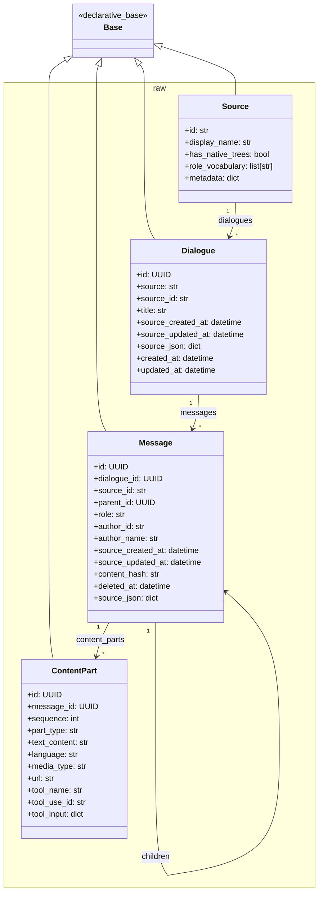
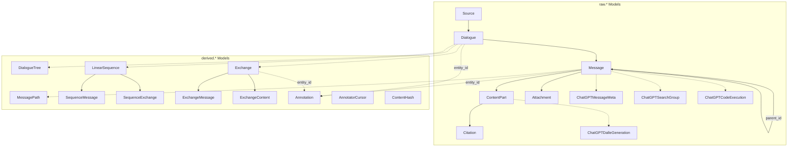

# docs/models.md
# SQLAlchemy Models

## Overview

The ORM layer provides Python classes that map to database tables, enabling type-safe data access and relationship navigation. Models are organized into two modules mirroring the database schemas:

- `models/raw.py` - Raw schema models (imports)
- `models/derived.py` - Derived schema models (computed)

## Model Organization



## Raw Models (`models/raw.py`)

### Core Models

#### Source

```python
class Source(Base):
    """Registry of dialogue sources."""
    __tablename__ = "sources"
    __table_args__ = {"schema": "raw"}
    
    id = Column(String, primary_key=True)
    display_name = Column(String, nullable=False)
    has_native_trees = Column(Boolean, nullable=False)
    role_vocabulary = Column(ARRAY(String), nullable=False)
    source_metadata = Column(JSONB, name="metadata")
    
    # Relationships
    dialogues = relationship("Dialogue", back_populates="source_rel")
```

**Usage:**
```python
# Check if source supports tree structure
if source.has_native_trees:
    # Handle ChatGPT-style branching
    
# Validate role
if message.role not in source.role_vocabulary:
    raise ValueError(f"Invalid role: {message.role}")
```

#### Dialogue

```python
class Dialogue(Base):
    """Universal dialogue container."""
    __tablename__ = "dialogues"
    __table_args__ = {"schema": "raw"}
    
    id = Column(PG_UUID(as_uuid=True), primary_key=True, 
                server_default=func.gen_random_uuid())
    source = Column(String, ForeignKey("raw.sources.id"), nullable=False)
    source_id = Column(String, nullable=False)
    
    title = Column(String)
    
    # Source timestamps (from archive)
    source_created_at = Column(DateTime(timezone=True))
    source_updated_at = Column(DateTime(timezone=True))
    
    source_json = Column(JSONB, nullable=False)
    
    # DB timestamps
    created_at = Column(DateTime(timezone=True), server_default=func.now())
    updated_at = Column(DateTime(timezone=True), server_default=func.now())
    
    # Relationships
    source_rel = relationship("Source", back_populates="dialogues")
    messages = relationship("Message", back_populates="dialogue", 
                           cascade="all, delete-orphan")
```

**Key Points:**
- `source_id`: Platform's native ID (for deduplication)
- `source_json`: Complete original export data
- Dual timestamp design: `source_*` vs `created_at/updated_at`

#### Message

```python
class Message(Base):
    """Universal message with tree structure support."""
    __tablename__ = "messages"
    __table_args__ = {"schema": "raw"}
    
    id = Column(PG_UUID(as_uuid=True), primary_key=True, 
                server_default=func.gen_random_uuid())
    dialogue_id = Column(PG_UUID(as_uuid=True), 
                        ForeignKey("raw.dialogues.id", ondelete="CASCADE"), 
                        nullable=False)
    source_id = Column(String, nullable=False)
    
    # Tree structure
    parent_id = Column(PG_UUID(as_uuid=True), ForeignKey("raw.messages.id"))
    
    role = Column(String, nullable=False)
    author_id = Column(String)
    author_name = Column(String)
    
    # Source timestamps
    source_created_at = Column(DateTime(timezone=True))
    source_updated_at = Column(DateTime(timezone=True))
    
    # Change tracking
    content_hash = Column(String)
    deleted_at = Column(DateTime(timezone=True))
    
    source_json = Column(JSONB, nullable=False)
    
    # Relationships
    dialogue = relationship("Dialogue", back_populates="messages")
    parent = relationship("Message", remote_side=[id], backref="children")
    content_parts = relationship("ContentPart", back_populates="message",
                                cascade="all, delete-orphan")
    attachments = relationship("Attachment", back_populates="message",
                              cascade="all, delete-orphan")
```

**Tree Navigation:**
```python
# Get children (regenerations/branches)
for child in message.children:
    print(f"Child: {child.id}")

# Walk up to root
current = message
while current.parent:
    current = current.parent
root = current

# Check if leaf
is_leaf = len(message.children) == 0
```

#### ContentPart

```python
class ContentPart(Base):
    """Content segments within a message."""
    __tablename__ = "content_parts"
    __table_args__ = {"schema": "raw"}
    
    id = Column(PG_UUID(as_uuid=True), primary_key=True,
                server_default=func.gen_random_uuid())
    message_id = Column(PG_UUID(as_uuid=True),
                       ForeignKey("raw.messages.id", ondelete="CASCADE"),
                       nullable=False)
    sequence = Column(Integer, nullable=False)
    
    part_type = Column(String, nullable=False)  # 'text', 'code', 'image', etc.
    text_content = Column(Text)
    
    # Code-specific
    language = Column(String)
    
    # Media-specific
    media_type = Column(String)
    url = Column(String)
    
    # Tool use (Claude)
    tool_name = Column(String)
    tool_use_id = Column(String)
    tool_input = Column(JSONB)
    
    # Timing
    started_at = Column(DateTime(timezone=True))
    ended_at = Column(DateTime(timezone=True))
    is_error = Column(Boolean, default=False)
    
    source_json = Column(JSONB, nullable=False)
    
    # Relationships
    message = relationship("Message", back_populates="content_parts")
    citations = relationship("Citation", back_populates="content_part",
                            cascade="all, delete-orphan")
```

**Part Type Discriminator:**

| `part_type` | Description | Key Fields |
|-------------|-------------|------------|
| `text` | Plain text content | `text_content` |
| `code` | Code block | `text_content`, `language` |
| `image` | Image reference | `media_type`, `url` |
| `tool_use` | Tool invocation | `tool_name`, `tool_use_id`, `tool_input` |
| `tool_result` | Tool response | `tool_use_id`, `text_content`, `is_error` |
| `thinking` | Reasoning content | `text_content` |

### ChatGPT Extension Models

```python
class ChatGPTMessageMeta(Base):
    """ChatGPT-specific message metadata."""
    __tablename__ = "chatgpt_message_meta"
    __table_args__ = {"schema": "raw"}
    
    message_id = Column(PG_UUID(as_uuid=True),
                       ForeignKey("raw.messages.id", ondelete="CASCADE"),
                       primary_key=True)
    model_slug = Column(String)          # 'gpt-4', 'gpt-4o', etc.
    status = Column(String)              # 'finished_successfully'
    end_turn = Column(Boolean)           # True if assistant finished turn
    gizmo_id = Column(String)            # Custom GPT identifier
    source_json = Column(JSONB, nullable=False)


class ChatGPTSearchGroup(Base):
    """ChatGPT search result groups."""
    # ... search metadata
    
class ChatGPTCodeExecution(Base):
    """ChatGPT code execution records."""
    # ... code interpreter metadata
    
class ChatGPTCanvasDoc(Base):
    """ChatGPT canvas document operations."""
    # ... canvas metadata
    
class ChatGPTDalleGeneration(Base):
    """ChatGPT DALL-E image generations."""
    # ... image generation metadata
```

---

## Derived Models (`models/derived.py`)

### Tree Analysis Models

#### DialogueTree

```python
class DialogueTree(Base):
    """Tree analysis results for a dialogue."""
    __tablename__ = "dialogue_trees"
    __table_args__ = {"schema": "derived"}
    
    dialogue_id = Column(PG_UUID(as_uuid=True),
                        ForeignKey("raw.dialogues.id", ondelete="CASCADE"),
                        primary_key=True)
    
    total_nodes = Column(Integer, nullable=False)
    max_depth = Column(Integer, nullable=False)
    branch_count = Column(Integer, nullable=False)
    leaf_count = Column(Integer, nullable=False)
    
    primary_leaf_id = Column(PG_UUID(as_uuid=True), ForeignKey("raw.messages.id"))
    primary_path_length = Column(Integer)
    
    # is_linear is GENERATED ALWAYS in SQL
    has_regenerations = Column(Boolean, nullable=False, default=False)
    has_edits = Column(Boolean, nullable=False, default=False)
    
    created_at = Column(DateTime(timezone=True), server_default=func.now())
```

**Usage:**
```python
# Check if dialogue is simple linear conversation
if tree.branch_count == 0:  # or tree.is_linear in SQL
    # Simple linear processing
else:
    # Handle branching conversation
```

#### MessagePath

```python
class MessagePath(Base):
    """Materialized path for a message in the tree."""
    __tablename__ = "message_paths"
    __table_args__ = {"schema": "derived"}
    
    message_id = Column(PG_UUID(as_uuid=True),
                       ForeignKey("raw.messages.id", ondelete="CASCADE"),
                       primary_key=True)
    dialogue_id = Column(PG_UUID(as_uuid=True),
                        ForeignKey("raw.dialogues.id", ondelete="CASCADE"),
                        nullable=False)
    
    ancestor_path = Column(ARRAY(PG_UUID(as_uuid=True)), nullable=False)
    depth = Column(Integer, nullable=False)
    
    is_root = Column(Boolean, nullable=False)
    is_leaf = Column(Boolean, nullable=False)
    child_count = Column(Integer, nullable=False)
    sibling_index = Column(Integer, nullable=False)
    
    is_on_primary_path = Column(Boolean, nullable=False)
```

### Exchange Models

#### Exchange

```python
class Exchange(Base):
    """Logical interaction unit (user prompt + assistant response)."""
    __tablename__ = "exchanges"
    __table_args__ = {"schema": "derived"}
    
    id = Column(PG_UUID(as_uuid=True), primary_key=True,
                server_default=func.gen_random_uuid())
    dialogue_id = Column(PG_UUID(as_uuid=True),
                        ForeignKey("raw.dialogues.id", ondelete="CASCADE"),
                        nullable=False)
    
    first_message_id = Column(PG_UUID(as_uuid=True),
                             ForeignKey("raw.messages.id"), nullable=False)
    last_message_id = Column(PG_UUID(as_uuid=True),
                            ForeignKey("raw.messages.id"), nullable=False)
    
    message_count = Column(Integer, nullable=False)
    user_message_count = Column(Integer, nullable=False)
    assistant_message_count = Column(Integer, nullable=False)
    
    is_continuation = Column(Boolean, default=False)
    continuation_of_id = Column(PG_UUID(as_uuid=True),
                               ForeignKey("derived.exchanges.id"))
    merged_count = Column(Integer, default=1)
    
    started_at = Column(DateTime(timezone=True))
    ended_at = Column(DateTime(timezone=True))
    
    created_at = Column(DateTime(timezone=True), server_default=func.now())
    
    # Relationships
    exchange_messages = relationship("ExchangeMessage", back_populates="exchange",
                                    cascade="all, delete-orphan")
    content = relationship("ExchangeContent", back_populates="exchange",
                          uselist=False, cascade="all, delete-orphan")
```

#### ExchangeContent

```python
class ExchangeContent(Base):
    """Aggregated content for an exchange."""
    __tablename__ = "exchange_content"
    __table_args__ = {"schema": "derived"}
    
    exchange_id = Column(PG_UUID(as_uuid=True),
                        ForeignKey("derived.exchanges.id", ondelete="CASCADE"),
                        primary_key=True)
    
    user_text = Column(Text)
    assistant_text = Column(Text)
    full_text = Column(Text)
    
    user_text_hash = Column(String)
    assistant_text_hash = Column(String)
    full_text_hash = Column(String)
    
    user_word_count = Column(Integer)
    assistant_word_count = Column(Integer)
    total_word_count = Column(Integer)
    
    created_at = Column(DateTime(timezone=True), server_default=func.now())
    
    # Relationship
    exchange = relationship("Exchange", back_populates="content")
```

### Annotation Models

#### Annotation

```python
class Annotation(Base):
    """Polymorphic annotation on any entity."""
    __tablename__ = "annotations"
    __table_args__ = {"schema": "derived"}
    
    id = Column(PG_UUID(as_uuid=True), primary_key=True,
                server_default=func.gen_random_uuid())
    
    # Polymorphic target
    entity_type = Column(String, nullable=False)  # 'message', 'exchange', 'dialogue'
    entity_id = Column(PG_UUID(as_uuid=True), nullable=False)
    
    # Annotation content
    annotation_type = Column(String, nullable=False)  # 'tag', 'feature', 'metadata'
    annotation_key = Column(String)                    # optional sub-key
    annotation_value = Column(String, nullable=False)
    annotation_data = Column(JSONB)
    
    # Provenance
    confidence = Column(Float)
    source = Column(String, nullable=False)            # 'manual', 'heuristic', 'model'
    source_version = Column(String)
    
    # Lifecycle
    created_at = Column(DateTime(timezone=True), server_default=func.now())
    superseded_at = Column(DateTime(timezone=True))
    superseded_by = Column(PG_UUID(as_uuid=True), ForeignKey("derived.annotations.id"))
```

**Querying Annotations:**
```python
# Get active annotations for an entity
annotations = (
    session.query(Annotation)
    .filter(Annotation.entity_type == 'exchange')
    .filter(Annotation.entity_id == exchange_id)
    .filter(Annotation.superseded_at.is_(None))  # Active only
    .all()
)

# Get all tags for an exchange
tags = (
    session.query(Annotation.annotation_value)
    .filter(Annotation.entity_type == 'exchange')
    .filter(Annotation.entity_id == exchange_id)
    .filter(Annotation.annotation_type == 'tag')
    .filter(Annotation.superseded_at.is_(None))
    .all()
)
```

#### AnnotatorCursor

```python
class AnnotatorCursor(Base):
    """Tracks processing state for incremental annotation."""
    __tablename__ = "annotator_cursors"
    __table_args__ = {"schema": "derived"}
    
    id = Column(PG_UUID(as_uuid=True), primary_key=True,
                server_default=func.gen_random_uuid())
    
    annotator_name = Column(String, nullable=False)
    annotator_version = Column(String, nullable=False)
    entity_type = Column(String, nullable=False)
    
    high_water_mark = Column(DateTime(timezone=True), nullable=False)
    
    entities_processed = Column(Integer, nullable=False, default=0)
    annotations_created = Column(Integer, nullable=False, default=0)
    
    updated_at = Column(DateTime(timezone=True), server_default=func.now())
```

---

## Model Relationships Diagram



---

## Module Exports (`models/__init__.py`)

```python
from llm_archive.models.raw import (
    Base,
    Source,
    Dialogue,
    Message,
    ContentPart,
    Citation,
    Attachment,
    ChatGPTMessageMeta,
    ChatGPTSearchGroup,
    ChatGPTSearchEntry,
    ChatGPTCodeExecution,
    ChatGPTCodeOutput,
    ChatGPTDalleGeneration,
    ChatGPTCanvasDoc,
    ClaudeMessageMeta,
)

from llm_archive.models.derived import (
    DialogueTree,
    MessagePath,
    LinearSequence,
    SequenceMessage,
    Exchange,
    ExchangeMessage,
    SequenceExchange,
    ExchangeContent,
    Annotation,
    ContentHash,
    AnnotatorCursor,
)
```

---

## Best Practices

### Querying with Relationships

```python
# Eager loading to avoid N+1 queries
dialogues = (
    session.query(Dialogue)
    .options(
        joinedload(Dialogue.messages)
        .joinedload(Message.content_parts)
    )
    .filter(Dialogue.source == 'chatgpt')
    .all()
)

# Explicit joins for complex queries
results = (
    session.query(Exchange, ExchangeContent)
    .join(ExchangeContent)
    .filter(ExchangeContent.assistant_word_count > 500)
    .all()
)
```

### Transaction Management

```python
from llm_archive.db import get_session

with get_session() as session:
    dialogue = Dialogue(source='chatgpt', source_id='abc', ...)
    session.add(dialogue)
    # Commits automatically on exit, rolls back on exception
```

### UUID Handling

```python
from uuid import UUID

# UUIDs are native Python UUID objects
exchange_id: UUID = exchange.id

# String conversion when needed
exchange_id_str = str(exchange.id)

# Parse from string
exchange_id = UUID('12345678-1234-5678-1234-567812345678')
```

---

## Related Documentation

- [Schema Design](schema.md) - Database schema details
- [Extractors](extractors.md) - How models are populated
- [Builders](builders.md) - How derived models are created
- [Annotators](annotators.md) - Working with annotations