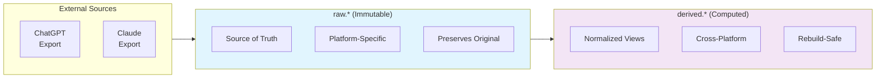
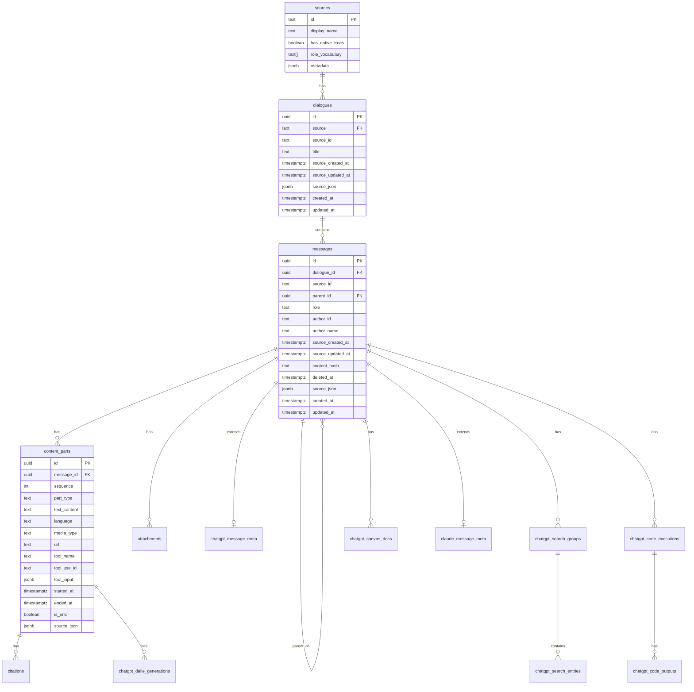
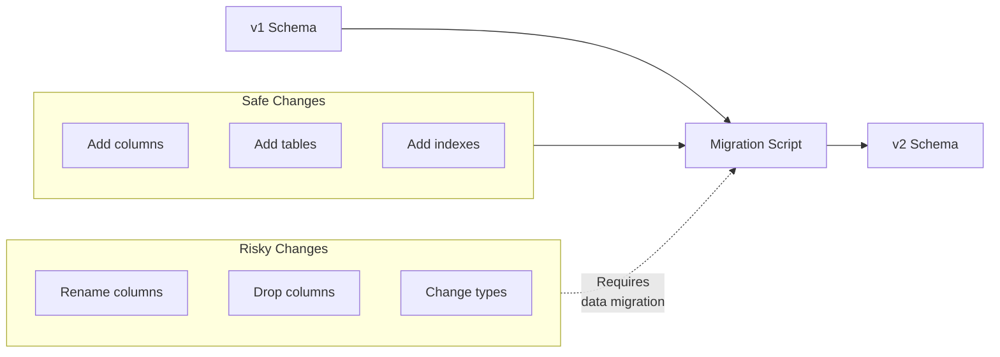

# docs/schema.md
# Database Schema Design

## Overview

The LLM Archive database uses a two-schema architecture that separates concerns between raw imported data and derived computed structures. This design ensures source fidelity while enabling rich analysis capabilities.

## Schema Philosophy



### Design Principles

| Principle | Implementation |
|-----------|---------------|
| **Source Fidelity** | `source_json` column preserves original data |
| **Platform Abstraction** | Core tables are platform-agnostic |
| **Extension Tables** | Platform-specific features in separate tables |
| **Temporal Tracking** | Both source and database timestamps |
| **Soft Deletes** | `deleted_at` for removed content |
| **Cascade Deletes** | Referential integrity maintained automatically |

## Raw Schema (`raw.*`)

The raw schema contains imported data exactly as received from source platforms.

### Entity Relationship Diagram



### Core Tables

#### `raw.sources`

Registry of supported data sources. Pre-populated with known platforms.

```sql
CREATE TABLE raw.sources (
    id                  text PRIMARY KEY,          -- 'chatgpt', 'claude'
    display_name        text NOT NULL,             -- 'ChatGPT', 'Claude'
    has_native_trees    boolean NOT NULL,          -- true for ChatGPT
    role_vocabulary     text[] NOT NULL,           -- ['user', 'assistant', ...]
    metadata            jsonb                       -- platform-specific config
);
```

**Design Notes:**
- `has_native_trees`: ChatGPT exports include branching; Claude exports are linear
- `role_vocabulary`: Validates message roles during import

#### `raw.dialogues`

Universal container for conversations from any source.

```sql
CREATE TABLE raw.dialogues (
    id                  uuid PRIMARY KEY DEFAULT gen_random_uuid(),
    source              text NOT NULL REFERENCES raw.sources(id),
    source_id           text NOT NULL,             -- platform's conversation ID
    title               text,
    
    -- Source timestamps (from archive export)
    source_created_at   timestamptz,
    source_updated_at   timestamptz,
    
    source_json         jsonb NOT NULL,            -- complete original object
    
    -- Database timestamps
    created_at          timestamptz DEFAULT now(),
    updated_at          timestamptz DEFAULT now(),
    
    UNIQUE (source, source_id)
);
```

**Design Notes:**
- Dual timestamp strategy: `source_*` from export, `created_at/updated_at` for DB tracking
- `source_json` preserves complete original data for debugging/audit
- Unique constraint prevents duplicate imports

#### `raw.messages`

Universal message representation with tree structure support.

```sql
CREATE TABLE raw.messages (
    id                  uuid PRIMARY KEY DEFAULT gen_random_uuid(),
    dialogue_id         uuid NOT NULL REFERENCES raw.dialogues ON DELETE CASCADE,
    source_id           text NOT NULL,             -- platform's message ID
    
    -- Tree structure
    parent_id           uuid REFERENCES raw.messages,
    
    -- Normalized fields
    role                text NOT NULL,             -- 'user', 'assistant', 'system', 'tool'
    author_id           text,                      -- for multi-user scenarios
    author_name         text,
    
    -- Source timestamps
    source_created_at   timestamptz,
    source_updated_at   timestamptz,
    
    -- Change tracking
    content_hash        text,                      -- SHA256 of content for diff
    deleted_at          timestamptz,               -- soft delete marker
    
    source_json         jsonb NOT NULL,
    
    -- Database timestamps
    created_at          timestamptz DEFAULT now(),
    updated_at          timestamptz DEFAULT now(),
    
    UNIQUE (dialogue_id, source_id)
);
```

**Design Notes:**
- Self-referential `parent_id` enables tree structure (for ChatGPT regenerations/edits)
- `content_hash` enables efficient change detection during incremental imports
- `deleted_at` tracks messages removed from source (vs. never existed)

#### `raw.content_parts`

Segmented content within a message (text, code, images, tool use).

```sql
CREATE TABLE raw.content_parts (
    id                  uuid PRIMARY KEY DEFAULT gen_random_uuid(),
    message_id          uuid NOT NULL REFERENCES raw.messages ON DELETE CASCADE,
    sequence            int NOT NULL,              -- ordering within message
    
    part_type           text NOT NULL,             -- 'text', 'code', 'image', 'tool_use', 'tool_result'
    text_content        text,
    
    -- Code-specific
    language            text,                      -- 'python', 'javascript', etc.
    
    -- Media-specific
    media_type          text,                      -- 'image/png', 'audio/mp3'
    url                 text,
    
    -- Tool use (Claude)
    tool_name           text,
    tool_use_id         text,                      -- correlates tool_use with tool_result
    tool_input          jsonb,
    
    -- Timing
    started_at          timestamptz,
    ended_at            timestamptz,
    is_error            boolean DEFAULT false,
    
    source_json         jsonb NOT NULL,
    
    UNIQUE (message_id, sequence)
);
```

**Design Notes:**
- `part_type` discriminates content categories
- `tool_use_id` links tool calls to their results (important for Claude agentic flows)
- `sequence` maintains ordering for multi-part messages

### Platform Extension Tables

#### ChatGPT Extensions

ChatGPT exports include rich metadata about platform features:

```mermaid
erDiagram
    messages ||--o| chatgpt_message_meta : "1:1"
    messages ||--o{ chatgpt_search_groups : "1:N"
    messages ||--o{ chatgpt_code_executions : "1:N"
    messages ||--o{ chatgpt_canvas_docs : "1:N"
    content_parts ||--o{ chatgpt_dalle_generations : "1:N"
    chatgpt_search_groups ||--o{ chatgpt_search_entries : "1:N"
    chatgpt_code_executions ||--o{ chatgpt_code_outputs : "1:N"

    chatgpt_message_meta {
        uuid message_id PK_FK
        text model_slug
        text status
        boolean end_turn
        text gizmo_id
    }
    
    chatgpt_search_groups {
        uuid id PK
        uuid message_id FK
        text group_type
        text domain
    }
    
    chatgpt_code_executions {
        uuid id PK
        uuid message_id FK
        text run_id
        text status
        text code
        text final_output
        text exception_name
    }
```

| Table | Purpose | Key Fields |
|-------|---------|------------|
| `chatgpt_message_meta` | Message-level metadata | `model_slug`, `gizmo_id` |
| `chatgpt_search_groups` | Web search result groups | `domain`, `group_type` |
| `chatgpt_search_entries` | Individual search results | `url`, `title`, `snippet` |
| `chatgpt_code_executions` | Code interpreter runs | `code`, `status`, `exception_name` |
| `chatgpt_code_outputs` | Execution outputs | `output_type`, `text_content`, `image_url` |
| `chatgpt_dalle_generations` | Image generation metadata | `prompt`, `seed`, `edit_op` |
| `chatgpt_canvas_docs` | Canvas document operations | `textdoc_type`, `version` |

#### Claude Extensions

```sql
CREATE TABLE raw.claude_message_meta (
    message_id  uuid PRIMARY KEY REFERENCES raw.messages ON DELETE CASCADE,
    source_json jsonb NOT NULL    -- placeholder for future Claude-specific fields
);
```

**Design Notes:**
- Currently minimal; Claude exports have fewer platform-specific features
- `source_json` preserves any additional metadata for future extraction

---

## Derived Schema (`derived.*`)

The derived schema contains computed structures built from raw data. These tables can be safely dropped and rebuilt.

### Entity Relationship Diagram

```mermaid
erDiagram
    dialogues ||--|| dialogue_trees : "analyzed_by"
    messages ||--|| message_paths : "has_path"
    dialogues ||--o{ linear_sequences : "has"
    dialogues ||--o{ exchanges : "has"
    
    linear_sequences ||--o{ sequence_messages : "contains"
    linear_sequences ||--o{ sequence_exchanges : "ordered_by"
    
    exchanges ||--o{ exchange_messages : "contains"
    exchanges ||--|| exchange_content : "has"
    exchanges ||--o{ sequence_exchanges : "in"
    
    dialogue_trees {
        uuid dialogue_id PK_FK
        int total_nodes
        int max_depth
        int branch_count
        int leaf_count
        uuid primary_leaf_id FK
        int primary_path_length
        boolean is_linear
        boolean has_regenerations
        boolean has_edits
    }
    
    message_paths {
        uuid message_id PK_FK
        uuid dialogue_id FK
        uuid[] ancestor_path
        int depth
        boolean is_root
        boolean is_leaf
        int child_count
        int sibling_index
        boolean is_on_primary_path
    }
    
    linear_sequences {
        uuid id PK
        uuid dialogue_id FK
        uuid leaf_message_id FK
        int sequence_length
        boolean is_primary
        text branch_reason
    }
    
    exchanges {
        uuid id PK
        uuid dialogue_id FK
        uuid first_message_id FK
        uuid last_message_id FK
        int message_count
        int user_message_count
        int assistant_message_count
        boolean is_continuation
        uuid continuation_of_id FK
        int merged_count
    }
    
    exchange_content {
        uuid exchange_id PK_FK
        text user_text
        text assistant_text
        text full_text
        text user_text_hash
        int user_word_count
        int assistant_word_count
    }
```

### Tree Analysis Tables

#### `derived.dialogue_trees`

Aggregate tree statistics for each dialogue.

```sql
CREATE TABLE derived.dialogue_trees (
    dialogue_id         uuid PRIMARY KEY REFERENCES raw.dialogues ON DELETE CASCADE,
    
    total_nodes         int NOT NULL,
    max_depth           int NOT NULL,
    branch_count        int NOT NULL,
    leaf_count          int NOT NULL,
    
    primary_leaf_id     uuid REFERENCES raw.messages,
    primary_path_length int,
    
    is_linear           boolean GENERATED ALWAYS AS (branch_count = 0) STORED,
    has_regenerations   boolean NOT NULL DEFAULT false,
    has_edits           boolean NOT NULL DEFAULT false,
    
    created_at          timestamptz DEFAULT now()
);
```

**Key Concepts:**
- `branch_count`: Number of messages with multiple children (regenerations)
- `primary_leaf_id`: The "main" conversation endpoint (most recent, deepest)
- `is_linear`: Computed column, true when no branching exists

#### `derived.message_paths`

Materialized path information for efficient tree traversal.

```sql
CREATE TABLE derived.message_paths (
    message_id          uuid PRIMARY KEY REFERENCES raw.messages ON DELETE CASCADE,
    dialogue_id         uuid NOT NULL REFERENCES raw.dialogues ON DELETE CASCADE,
    
    ancestor_path       uuid[] NOT NULL,           -- [root, ..., parent] (excludes self)
    depth               int NOT NULL,              -- 0 for root
    
    is_root             boolean NOT NULL,
    is_leaf             boolean NOT NULL,
    child_count         int NOT NULL,
    sibling_index       int NOT NULL,              -- 0-based position among siblings
    
    is_on_primary_path  boolean NOT NULL,
    
    created_at          timestamptz DEFAULT now()
);
```

**Key Concepts:**
- `ancestor_path`: PostgreSQL array enabling efficient ancestry queries
- `is_on_primary_path`: Marks messages in the "main" conversation flow

### Sequence Tables

#### `derived.linear_sequences`

Each root-to-leaf path as a linear sequence.

```sql
CREATE TABLE derived.linear_sequences (
    id                      uuid PRIMARY KEY DEFAULT gen_random_uuid(),
    dialogue_id             uuid NOT NULL REFERENCES raw.dialogues ON DELETE CASCADE,
    leaf_message_id         uuid NOT NULL REFERENCES raw.messages,
    
    sequence_length         int NOT NULL,
    is_primary              boolean NOT NULL,
    
    branch_reason           text,                  -- 'regeneration' | 'edit' | 'fork'
    branched_at_message_id  uuid REFERENCES raw.messages,
    branched_at_depth       int,
    
    created_at              timestamptz DEFAULT now(),
    
    UNIQUE (dialogue_id, leaf_message_id)
);
```

**Design Notes:**
- One sequence per leaf message in the tree
- `is_primary`: Marks the main conversation path
- `branch_reason`: Explains why this sequence diverged

### Exchange Tables

#### `derived.exchanges`

The fundamental interaction unit: user prompt(s) + assistant response(s).

```sql
CREATE TABLE derived.exchanges (
    id                      uuid PRIMARY KEY DEFAULT gen_random_uuid(),
    dialogue_id             uuid NOT NULL REFERENCES raw.dialogues ON DELETE CASCADE,
    
    -- Message range (contiguous on tree path)
    first_message_id        uuid NOT NULL REFERENCES raw.messages,
    last_message_id         uuid NOT NULL REFERENCES raw.messages,
    
    -- Statistics
    message_count           int NOT NULL,
    user_message_count      int NOT NULL,
    assistant_message_count int NOT NULL,
    
    -- Continuation tracking
    is_continuation         boolean DEFAULT false,
    continuation_of_id      uuid REFERENCES derived.exchanges,
    merged_count            int DEFAULT 1,
    
    -- Timestamps (from constituent messages)
    started_at              timestamptz,
    ended_at                timestamptz,
    
    created_at              timestamptz DEFAULT now(),
    
    UNIQUE (dialogue_id, first_message_id, last_message_id)
);
```

**Design Notes:**
- Exchanges are identified by their message range (first, last)
- `is_continuation`: True when user said "continue", etc.
- `merged_count`: Number of original exchanges combined

#### `derived.exchange_content`

Aggregated text content for efficient querying.

```sql
CREATE TABLE derived.exchange_content (
    exchange_id             uuid PRIMARY KEY REFERENCES derived.exchanges ON DELETE CASCADE,
    
    user_text               text,
    assistant_text          text,
    full_text               text,
    
    user_text_hash          text,
    assistant_text_hash     text,
    full_text_hash          text,
    
    user_word_count         int,
    assistant_word_count    int,
    total_word_count        int,
    
    created_at              timestamptz DEFAULT now()
);
```

### Annotation Tables

#### `derived.annotations`

Polymorphic annotation system supporting any entity type.

```sql
CREATE TABLE derived.annotations (
    id                      uuid PRIMARY KEY DEFAULT gen_random_uuid(),
    
    -- Polymorphic target
    entity_type             text NOT NULL,         -- 'message', 'exchange', 'dialogue'
    entity_id               uuid NOT NULL,
    
    -- Annotation content
    annotation_type         text NOT NULL,         -- 'tag', 'feature', 'metadata', 'title'
    annotation_key          text,                  -- sub-key (e.g., 'code_language')
    annotation_value        text NOT NULL,
    annotation_data         jsonb,                 -- additional structured data
    
    -- Provenance
    confidence              float,                 -- 0.0-1.0 for probabilistic annotations
    source                  text NOT NULL,         -- 'manual', 'heuristic', 'model'
    source_version          text,
    
    -- Lifecycle
    created_at              timestamptz DEFAULT now(),
    superseded_at           timestamptz,           -- soft-delete for versioning
    superseded_by           uuid REFERENCES derived.annotations,
    
    UNIQUE NULLS NOT DISTINCT (
        entity_type, entity_id, annotation_type, 
        annotation_key, annotation_value, superseded_at
    )
);
```

**Design Notes:**
- `entity_type + entity_id`: Polymorphic foreign key pattern
- `superseded_at/superseded_by`: Enables annotation versioning
- Unique constraint uses `NULLS NOT DISTINCT` for proper NULL handling

#### `derived.annotator_cursors`

Tracks incremental processing state for each annotator.

```sql
CREATE TABLE derived.annotator_cursors (
    id                      uuid PRIMARY KEY DEFAULT gen_random_uuid(),
    
    annotator_name          text NOT NULL,
    annotator_version       text NOT NULL,
    entity_type             text NOT NULL,
    
    -- High water mark: last processed entity timestamp
    high_water_mark         timestamptz NOT NULL,
    
    -- Statistics
    entities_processed      int NOT NULL DEFAULT 0,
    annotations_created     int NOT NULL DEFAULT 0,
    
    updated_at              timestamptz DEFAULT now(),
    
    UNIQUE (annotator_name, annotator_version, entity_type)
);
```

**Design Notes:**
- Each annotator+version+entity_type gets its own cursor
- Bumping VERSION in annotator code forces reprocessing

---

## Indexing Strategy

### Raw Schema Indexes

```sql
-- Dialogue lookup
CREATE INDEX idx_raw_dialogues_source ON raw.dialogues(source, source_id);
CREATE INDEX idx_raw_dialogues_created ON raw.dialogues(created_at);

-- Message tree traversal
CREATE INDEX idx_raw_messages_dialogue ON raw.messages(dialogue_id);
CREATE INDEX idx_raw_messages_parent ON raw.messages(parent_id);
CREATE INDEX idx_raw_messages_role ON raw.messages(role);
CREATE INDEX idx_raw_messages_created ON raw.messages(created_at);

-- Content part ordering
CREATE INDEX idx_raw_content_parts_message ON raw.content_parts(message_id, sequence);

-- Platform extension lookups
CREATE INDEX idx_raw_chatgpt_search_groups_msg ON raw.chatgpt_search_groups(message_id);
CREATE INDEX idx_raw_chatgpt_code_exec_msg ON raw.chatgpt_code_executions(message_id);
```

### Derived Schema Indexes

```sql
-- Tree analysis
CREATE INDEX idx_derived_trees_linear ON derived.dialogue_trees(is_linear);
CREATE INDEX idx_derived_trees_branched ON derived.dialogue_trees(branch_count) WHERE branch_count > 0;

-- Path queries
CREATE INDEX idx_derived_paths_dialogue ON derived.message_paths(dialogue_id);
CREATE INDEX idx_derived_paths_primary ON derived.message_paths(dialogue_id) WHERE is_on_primary_path;

-- Exchange lookups
CREATE INDEX idx_derived_exchanges_dialogue ON derived.exchanges(dialogue_id);

-- Annotation queries (partial indexes for active only)
CREATE INDEX idx_derived_annotations_entity ON derived.annotations(entity_type, entity_id) 
    WHERE superseded_at IS NULL;
CREATE INDEX idx_derived_annotations_type ON derived.annotations(annotation_type, annotation_value) 
    WHERE superseded_at IS NULL;
```

---

## Schema Evolution

### Adding Platform Extensions

1. Create extension table with FK to `raw.messages` or `raw.content_parts`
2. Add corresponding SQLAlchemy model
3. Update extractor to populate new table
4. Optionally add platform-specific annotators

### Modifying Derived Schema

1. Derived tables can be safely dropped/recreated
2. Update SQL definition in `schema/002_derived.sql`
3. Update SQLAlchemy model
4. Re-run builders to repopulate

### Migration Strategy



---

## Related Documentation

- [Architecture Overview](architecture.md)
- [Models](models.md) - SQLAlchemy ORM models
- [Extractors](extractors.md) - Data extraction system
- [Builders](builders.md) - Derived data construction