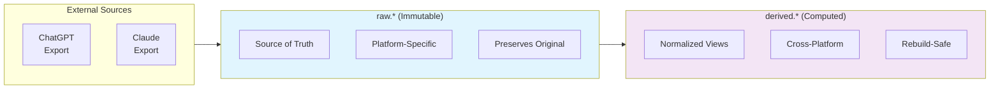
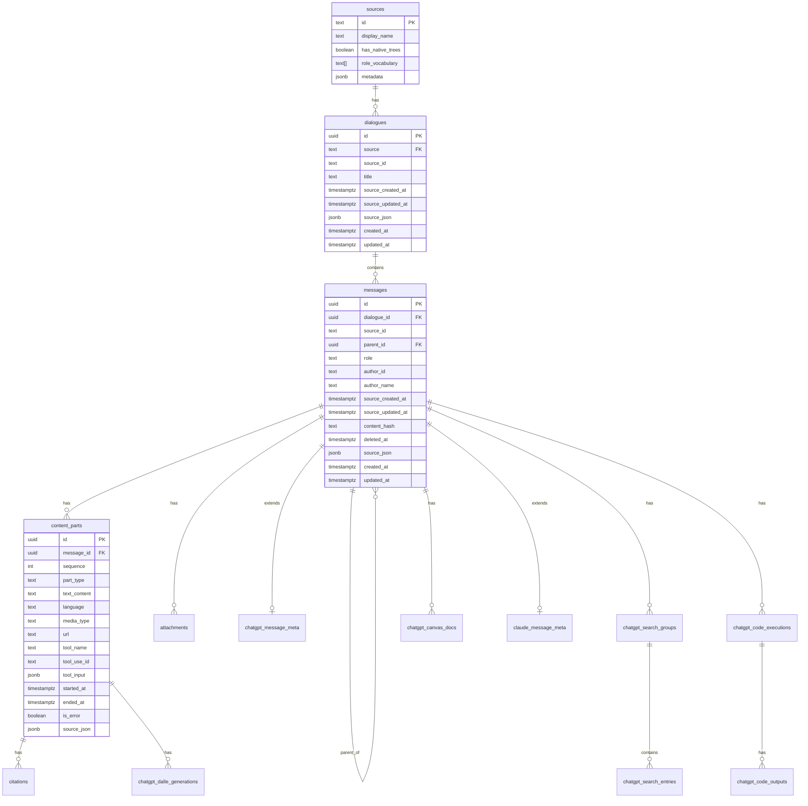

# docs/schema.md
# Database Schema Design

## Overview

The LLM Archive database uses a two-schema architecture that separates concerns between raw imported data and derived computed structures. This design ensures source fidelity while enabling rich analysis capabilities.

## Schema Philosophy



### Design Principles

| Principle | Implementation |
|-----------|---------------|
| **Source Fidelity** | `source_json` column preserves original data |
| **Platform Abstraction** | Core tables are platform-agnostic |
| **Extension Tables** | Platform-specific features in separate tables |
| **Temporal Tracking** | Both source and database timestamps |
| **Soft Deletes** | `deleted_at` for removed content |
| **Cascade Deletes** | Referential integrity maintained automatically |

## Raw Schema (`raw.*`)

The raw schema contains imported data exactly as received from source platforms.

### Entity Relationship Diagram



### Core Tables

#### `raw.sources`

Registry of supported data sources. Pre-populated with known platforms.

```sql
CREATE TABLE raw.sources (
    id                  text PRIMARY KEY,          -- 'chatgpt', 'claude'
    display_name        text NOT NULL,             -- 'ChatGPT', 'Claude'
    has_native_trees    boolean NOT NULL,          -- true for ChatGPT
    role_vocabulary     text[] NOT NULL,           -- ['user', 'assistant', ...]
    metadata            jsonb                       -- platform-specific config
);
```

**Design Notes:**
- `has_native_trees`: ChatGPT exports include branching; Claude exports are linear
- `role_vocabulary`: Validates message roles during import

#### `raw.dialogues`

Universal container for conversations from any source.

```sql
CREATE TABLE raw.dialogues (
    id                  uuid PRIMARY KEY DEFAULT gen_random_uuid(),
    source              text NOT NULL REFERENCES raw.sources(id),
    source_id           text NOT NULL,             -- platform's conversation ID
    title               text,
    
    -- Source timestamps (from archive export)
    source_created_at   timestamptz,
    source_updated_at   timestamptz,
    
    source_json         jsonb NOT NULL,            -- complete original object
    
    -- Database timestamps
    created_at          timestamptz DEFAULT now(),
    updated_at          timestamptz DEFAULT now(),
    
    UNIQUE (source, source_id)
);
```

**Design Notes:**
- Dual timestamp strategy: `source_*` from export, `created_at/updated_at` for DB tracking
- `source_json` preserves complete original data for debugging/audit
- Unique constraint prevents duplicate imports

#### `raw.messages`

Universal message representation with tree structure support.

```sql
CREATE TABLE raw.messages (
    id                  uuid PRIMARY KEY DEFAULT gen_random_uuid(),
    dialogue_id         uuid NOT NULL REFERENCES raw.dialogues ON DELETE CASCADE,
    source_id           text NOT NULL,             -- platform's message ID
    
    -- Tree structure
    parent_id           uuid REFERENCES raw.messages,
    
    -- Normalized fields
    role                text NOT NULL,             -- 'user', 'assistant', 'system', 'tool'
    author_id           text,                      -- for multi-user scenarios
    author_name         text,
    
    -- Source timestamps
    source_created_at   timestamptz,
    source_updated_at   timestamptz,
    
    -- Change tracking
    content_hash        text,                      -- SHA256 of content for diff
    deleted_at          timestamptz,               -- soft delete marker
    
    source_json         jsonb NOT NULL,
    
    -- Database timestamps
    created_at          timestamptz DEFAULT now(),
    updated_at          timestamptz DEFAULT now(),
    
    UNIQUE (dialogue_id, source_id)
);
```

**Design Notes:**
- Self-referential `parent_id` enables tree structure (for ChatGPT regenerations/edits)
- `content_hash` enables efficient change detection during incremental imports
- `deleted_at` tracks messages removed from source (vs. never existed)

#### `raw.content_parts`

Segmented content within a message (text, code, images, tool use).

```sql
CREATE TABLE raw.content_parts (
    id                  uuid PRIMARY KEY DEFAULT gen_random_uuid(),
    message_id          uuid NOT NULL REFERENCES raw.messages ON DELETE CASCADE,
    sequence            int NOT NULL,              -- ordering within message
    
    part_type           text NOT NULL,             -- 'text', 'code', 'image', 'tool_use', 'tool_result'
    text_content        text,
    
    -- Code-specific
    language            text,                      -- 'python', 'javascript', etc.
    
    -- Media-specific
    media_type          text,                      -- 'image/png', 'audio/mp3'
    url                 text,
    
    -- Tool use (Claude)
    tool_name           text,
    tool_use_id         text,                      -- correlates tool_use with tool_result
    tool_input          jsonb,
    
    -- Timing
    started_at          timestamptz,
    ended_at            timestamptz,
    is_error            boolean DEFAULT false,
    
    source_json         jsonb NOT NULL,
    
    UNIQUE (message_id, sequence)
);
```

**Design Notes:**
- `part_type` discriminates content categories
- `tool_use_id` links tool calls to their results (important for Claude agentic flows)
- `sequence` maintains ordering for multi-part messages

### Platform Extension Tables

#### ChatGPT Extensions

ChatGPT exports include rich metadata about platform features:

```mermaid
erDiagram
    messages ||--o| chatgpt_message_meta : "1:1"
    messages ||--o{ chatgpt_search_groups : "1:N"
    messages ||--o{ chatgpt_code_executions : "1:N"
    messages ||--o{ chatgpt_canvas_docs : "1:N"
    content_parts ||--o{ chatgpt_dalle_generations : "1:N"
    chatgpt_search_groups ||--o{ chatgpt_search_entries : "1:N"
    chatgpt_code_executions ||--o{ chatgpt_code_outputs : "1:N"

    chatgpt_message_meta {
        uuid message_id PK_FK
        text model_slug
        text status
        boolean end_turn
        text gizmo_id
    }
    
    chatgpt_search_groups {
        uuid id PK
        uuid message_id FK
        text group_type
        text domain
    }
    
    chatgpt_code_executions {
        uuid id PK
        uuid message_id FK
        text run_id
        text status
        text code
        text final_output
        text exception_name
    }
```

| Table | Purpose | Key Fields |
|-------|---------|------------|
| `chatgpt_message_meta` | Message-level metadata | `model_slug`, `gizmo_id` |
| `chatgpt_search_groups` | Web search result groups | `domain`, `group_type` |
| `chatgpt_search_entries` | Individual search results | `url`, `title`, `snippet` |
| `chatgpt_code_executions` | Code interpreter runs | `code`, `status`, `exception_name` |
| `chatgpt_code_outputs` | Execution outputs | `output_type`, `text_content`, `image_url` |
| `chatgpt_dalle_generations` | Image generation metadata | `prompt`, `seed`, `edit_op` |
| `chatgpt_canvas_docs` | Canvas document operations | `textdoc_type`, `version` |

#### Claude Extensions

```sql
CREATE TABLE raw.claude_message_meta (
    message_id  uuid PRIMARY KEY REFERENCES raw.messages ON DELETE CASCADE,
    source_json jsonb NOT NULL    -- placeholder for future Claude-specific fields
);
```

**Design Notes:**
- Currently minimal; Claude exports have fewer platform-specific features
- `source_json` preserves any additional metadata for future extraction

---

#### `derived.annotator_cursors`

Tracks incremental processing state for each annotator.

```sql
CREATE TABLE derived.annotator_cursors (
    id                      uuid PRIMARY KEY DEFAULT gen_random_uuid(),
    
    annotator_name          text NOT NULL,
    annotator_version       text NOT NULL,
    entity_type             text NOT NULL,
    
    -- High water mark: last processed entity timestamp
    high_water_mark         timestamptz NOT NULL,
    
    -- Statistics
    entities_processed      int NOT NULL DEFAULT 0,
    annotations_created     int NOT NULL DEFAULT 0,
    
    updated_at              timestamptz DEFAULT now(),
    
    UNIQUE (annotator_name, annotator_version, entity_type)
);
```

**Design Notes:**
- Each annotator+version+entity_type gets its own cursor
- Bumping VERSION in annotator code forces reprocessing

---

## Related Documentation

- [Architecture Overview](architecture.md)
- [Models](models.md) - SQLAlchemy ORM models
- [Extractors](extractors.md) - Data extraction system
- [Builders](builders.md) - Derived data construction
